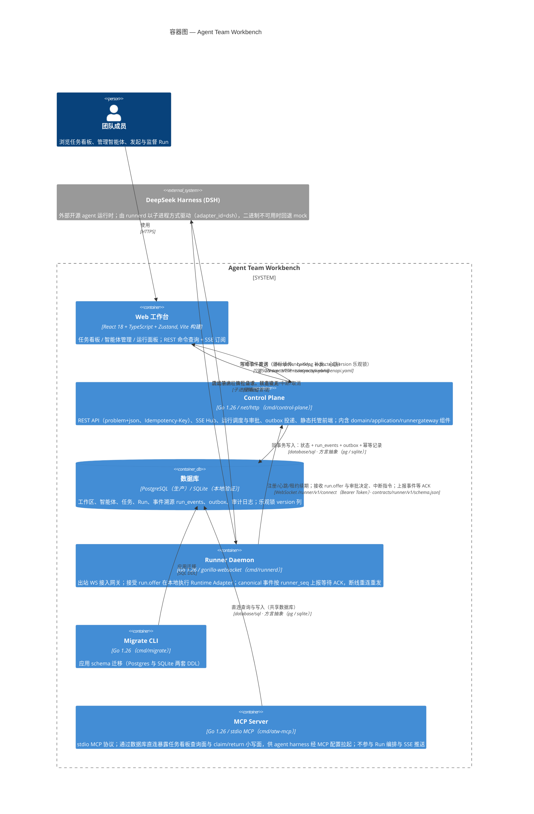

# C4 容器图（Container Diagram）— Agent Team Workbench

> C4 Level 2。对应代码版本：`6574fd9`（2026-08-26）。
> 更下层的模块划分（control-plane 内部的 httpapi / application / domain / sse / outbox / runnergateway 等）属于 Component 图（Level 3）范畴，见文末备注。

## 容器职责一览

| 容器 | 部署形态 | 核心职责 | 关键技术 |
|---|---|---|---|
| Web 工作台 | 静态产物（由 Control Plane 托管，也可独立部署） | 任务看板、智能体设置、运行面板与审批交互；消费 SSE 维持实时视图 | React 18、TypeScript（strict）、Zustand、Vite |
| Control Plane | 单进程服务（`:8080`） | REST API 与 problem+json 错误语义；SSE 事件流；命令幂等；Run 编排（创建/中断/审批/重试）；runner 网关与租约清扫；outbox 投递 | Go 1.26、net/http、gorilla/websocket |
| Runner Daemon | 本机/远程独立进程，可水平扩展 | 接受 run.offer 后在本地执行 Runtime Adapter（mock 或 DSH 子进程）；事件带 runner_seq 上报，未 ACK 的断线重发 | Go 1.26、gorilla/websocket |
| 数据库 | PostgreSQL（生产）/ SQLite（本地） | 权威状态 + 事件溯源（run_events/stream_seq）+ outbox + 幂等键表 + 审计；所有写走 InTx 同事务提交 | database/sql、advisory lock 序号分配 |
| Migrate CLI | 按需执行的一次性工具 | 建库/升级 schema（migrations/ 为 Postgres 版，migrations/sqlite/ 为本地版） | Go 1.26 |
| MCP Server | 由 agent harness 的 MCP 配置拉起，与 Control Plane 共享数据库 | 通过 stdio MCP 协议暴露任务看板查询面与 claim/return 小写面；不参与 Run 编排与 SSE 推送 | Go 1.26、mark3labs/mcp-go |

## 跨容器契约

四份契约文件是容器间集成的权威定义（其中 contracts/runner/v1/schema.json 与 contracts/runtime/v1/schema.json 后者为前者的荷载规范）：

- `contracts/web/openapi.yaml` —— Web ↔ Control Plane 的 REST 契约；
- `contracts/events/asyncapi.yaml` —— Control Plane → Web 的 SSE 领域事件白名单；
- `contracts/runner/v1/schema.json` —— Control Plane ↔ Runner Daemon 的 WebSocket 信封协议（连接端点 /runner/v1/connect，Bearer runner-service-token）；
- `contracts/runtime/v1/schema.json` —— 通用 Runtime Bridge 统一信封契约（进程内 ModuleRunner 与外部 Runner 共用 canonical 事件与命令荷载）。

## 图上未展开的设计要点

- **事务模型**：Control Plane 的所有写命令在单个数据库事务内同时落「实体状态 + run_events + outbox + 幂等记录」，提交后才经 Notifier 唤醒 SSE / 经 Dispatcher 分派。
- **执行面位置**：M1 时 adapter 在 Control Plane 进程内执行（mock）；M2 起 Run 经网关以 `run.offer` 交给 Runner Daemon 本地执行，DSH 以子进程接入（`internal/runtime/adapters/dsh`），不可用时回退 mock。
- **可靠性约定**：Web 写命令强制 Idempotency-Key；实体更新走 expected_version 乐观锁（0 = 跳过检测的哨兵值）；SSE 支持游标续传与 410 重置；Runner 事件按 `(runner_id, runner_seq)` 去重。
- **安全现状**：认证为演示用硬编码用户（`/api/v1/me` 返回 `user_demo`，角色 `owner`）；security 包已实现 RBAC 权限模型（`internal/security/rbac.go`），`guard` 中间件按 demoRole 校验权限，但认证层尚未接入真实身份提供方；Runner 接入用可选 Bearer Token（环境变量 `RUNNER_TOKEN`）。
- **正文渲染**：Web 前端已引入 react-markdown、mermaid、katex、highlight.js、dompurify、motion 等库，用于渲染智能体输出的富文本内容（LeAgent 骨架，2026-08-26 切换）。

## 备注：Level 3（Component 图）待展开的内部组件

Control Plane 内部：`httpapi`（路由/SSE/problem 映射）、`application`（用例与 Store/Dispatcher/Notifier 接口）、`domain`（纯领域模型与状态机）、`persistence/sqlstore`、`sse.Hub`、`outbox.Publisher`、`runnergateway.Gateway`、`orchestrator`（OrchestrationPlan 词汇表与确定性 plan 执行器）、`knowledge`（知识语料检索器）、`scheduling`（wakeup 调度循环）、`agentconfig`（文件系统 agent 配置导入）、`agentwork`（项目空间与执行根解析）、`modelconfig`（模型注册表与凭据管理）。Runner Daemon 内部：`runtime.Adapter` SPI 及 mock / dsh / scripted / codexapp / kimi / kimiapp / claudecode / zcode 等实现。MCP Server 内部：`mcpserver`（工具注册与 MCP 服务装配）。这些可在后续 Component 图中展开。
