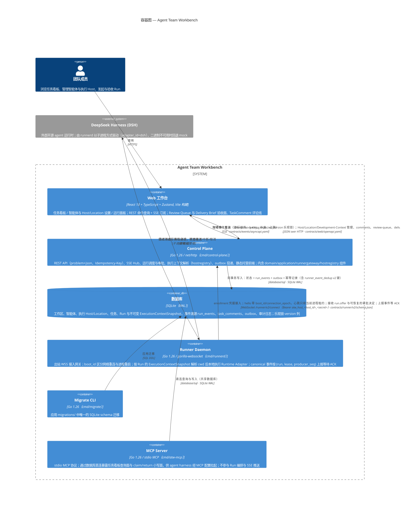

# C4 容器图（Container Diagram）— Agent Team Workbench

> C4 Level 2。对应代码版本：任务控制面（Execution Context / TaskComment / Review Surface / Runner v2）落地后（2026-08-31，分支 `codex/task-control-surface`）。
> 更下层的模块划分（control-plane 内部的 httpapi / application / domain / sse / outbox / runnergateway / hostregistry 等）属于 Component 图（Level 3）范畴，见文末备注。

## 容器职责一览

| 容器 | 部署形态 | 核心职责 | 关键技术 |
|---|---|---|---|
| Web 工作台 | 静态产物（由 Control Plane 托管，也可独立部署） | 任务看板、智能体设置、执行 Host/Location 设置、运行面板与审批交互、TaskComment 评论线；Review Queue / Delivery Brief 服务端权威验收面；消费 SSE 维持实时视图 | React 18、TypeScript（strict）、Zustand、Vite |
| Control Plane | 单进程服务（`:8080`） | REST API 与 problem+json 错误语义；SSE 事件流；命令幂等；Run 编排（创建/中断/审批/重试）与每 Run 不可变 ExecutionContextSnapshot 解析（hostregistry 精确路由，错误 Host/mount fail closed）；runner 网关与租约清扫；outbox 投递 | Go 1.26、net/http、gorilla/websocket |
| Runner Daemon | 绑定 Execution Host 的本机/远程独立进程，可水平扩展 | 以 enrollment 凭据接入 `/runner/v2/connect`；同 boot 网络重连恢复 lease/pending，进程重启释放旧 lease；接受 run.offer 后按 Snapshot 解析的 cwd 在本地执行 Runtime Adapter；事件带 lease/producer_seq 上报，未 ACK 的断线重发 | Go 1.26、gorilla/websocket |
| 数据库 | SQLite（单一后端，WAL） | 权威状态 + 事件溯源（run_events/stream_seq）+ outbox + 幂等键表（含 runner_event_dedup v2）+ 审计 + execution_hosts/workspace_locations/execution_context_snapshots/task_comments；所有写走 InTx 同事务提交 | database/sql、SQLite FTS5 |
| Migrate CLI | 按需执行的一次性工具 | 从 `migrations/` 建库或幂等升级 SQLite schema | Go 1.26 |
| MCP Server | 由 agent harness 的 MCP 配置拉起，与 Control Plane 共享数据库 | 通过 stdio MCP 协议暴露任务看板查询面与 claim/return 小写面；不参与 Run 编排与 SSE 推送 | Go 1.26、mark3labs/mcp-go |

## 跨容器契约

三份契约文件是容器间集成的权威定义：

- `contracts/web/openapi.yaml` —— Web ↔ Control Plane 的 REST 契约；
- `contracts/events/asyncapi.yaml` —— Control Plane → Web 的 SSE 领域事件白名单；
- `contracts/runner/v2/schema.json` —— Control Plane ↔ Runner Daemon 的 WebSocket 信封协议（连接端点 /runner/v2/connect，Bearer enrollment 凭据 `atw_host_<host_id>_<secret>`；v1 信封与 `/runner/v1/connect` 已随 Runner v2 退役）。

Runtime 侧的 canonical 事件与命令荷载不在契约文件里，权威定义是代码：`internal/runtime/spi.go`（message.*/tool.*/run.* 白名单）与 `internal/runtime/adapter.go`（AdapterManifest/Probe 面）。原 `contracts/runtime/v1/schema.json` 从未接线，已退役（2026-08-28）。

## 图上未展开的设计要点

- **事务模型**：Control Plane 的所有写命令在单个数据库事务内同时落「实体状态 + run_events + outbox + 幂等记录」，提交后才经 Notifier 唤醒 SSE / 经 Dispatcher 分派。
- **执行上下文（任务控制面）**：Workspace 配置 ExecutionHost（含 HostMount）与 WorkspaceLocation；Run 创建时在同一事务固化不可变 ExecutionContextSnapshot（13 身份字段 digest），Dispatch 经 hostregistry 按 mount/ref 精确路由到目标 Host——错误 Host、错误 mount、错误 worktree 一律 fail closed，不跨 Host/本机回退；Adapter 只读 `ExecContext.Resolved.CWD`，不存在全局 executionRoot/WorkspaceRoot 注入。
- **反馈与验收面（任务控制面）**：用户反馈走 TaskComment（revision 追加、Coordinator 按消费水位在 durable turn 摄取，取代旧 coordinator/messages 指令轨）；Review Queue 与 Delivery Brief 是服务端权威读模型（确定性排序 + 不透明游标 + total_count 独立计数）。
- **执行面位置**：本机 Snapshot 走进程内 ModuleRunner；远程 Snapshot 经网关以 `run.offer` 交给目标 Runner Daemon。Runner v2 只落在 Snapshot 绑定的 Execution Host，Host/Runner 不可用时 fail closed，禁止跨 Host 或回退本机。
- **可靠性约定**：Web 写命令强制 Idempotency-Key；实体更新走 expected_version 乐观锁；SSE 支持游标续传与 410 重置；Runner 事件按 `(run_id, lease_id, runner_id, producer_seq)` 去重（dedup 与 Run 状态推进同事务，commit 前不 ACK）；runner-local approval id 持久化，Gateway 重启/同 boot 重连后可重放已决审批。
- **安全现状**：认证为演示用硬编码用户（`/api/v1/me` 返回 `user_demo`，角色 `owner`）；security 包已实现 RBAC 权限模型（`internal/security/rbac.go`），`guard` 中间件按 demoRole 校验权限，但认证层尚未接入真实身份提供方；Runner 接入用 enrollment 双重凭据（WSS 升级 + runner.hello 各校验一次，支持 rotate-credential）。
- **正文渲染**：Web 前端已引入 react-markdown、mermaid、katex、highlight.js、dompurify、motion 等库，用于渲染智能体输出的富文本内容（LeAgent 骨架，2026-08-26 切换）。

## 备注：Level 3（Component 图）待展开的内部组件

Control Plane 内部：`httpapi`（路由/SSE/problem 映射）、`application`（用例与 Store/Dispatcher/Notifier 接口）、`domain`（纯领域模型与状态机）、`persistence/sqlstore`、`sse.Hub`、`outbox.Publisher`、`runnergateway.Gateway`、`hostregistry`（ExecutionHost 注册与 ExecutionContextSnapshot → ResolvedExecutionContext 解析）、`orchestrator`（OrchestrationPlan 词汇表与确定性 plan 执行器）、`knowledge`（知识语料检索器）、`scheduling`（wakeup 调度循环）、`agentconfig`（文件系统 agent 配置导入）、`agentwork`（项目空间与本地 Runtime 目录解析）、`modelconfig`（模型注册表与凭据管理）。Runner Daemon 内部：`runtime.Adapter` SPI 及 mock / dsh / scripted / codexapp / kimi / kimiapp / claudecode / zcode 等实现。MCP Server 内部：`mcpserver`（工具注册与 MCP 服务装配）。这些可在后续 Component 图中展开。
