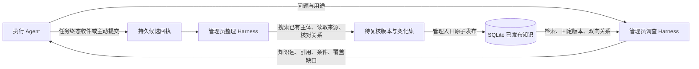

# 知识管理员：读写闭环与 Harness 实施方案

状态：已实现本机闭环；证据见[验收记录](../review/knowledge-librarian-acceptance.md)。日期：2026-09-06。基线：main@12906d6。

## 1. 目标与边界

知识管理员是一个能够规划调查、查阅证据、展开功能关系、检查覆盖并整理知识的 Agent。查询多、更新少；实现重点是调查完整性与可靠发布，不能以关键词 Top-K 或一段提示词替代 Harness。

统一知识层提供 Agent 专属和 Workspace/项目共享视图。角色、贡献者、整理者与访问范围独立。所有模型执行继续经过 WorkItem → ExecutionRun → ModuleRunner/RunnerGateway；知识作业只是应用层持久业务状态，不增加第二套 Run、Lease、调度或计费权威。

“完整”仅表示在明确的来源、版本、可见范围与调查预算内，必答维度和已发现的必要关联均得到处理；资料不足、冲突、截断或预算耗尽必须显式返回 incomplete/conflict，不能由模型自行宣布完整。

本次交付包含：知识结构与版本发布、候选提交与核实、双向关系检索、专用多轮调查/整理 Harness、任务结束收件、HTTP/Agent 查询和提交接口、管理与查询界面、迁移与回归/真实路径验收。

外部源码读取默认关闭；只有来源策略显式授权的代码/测试才进入调查范围，未授权来源不能自动扫描，也不能被标成已覆盖。已入库证据、引用与关系是默认调查范围。

## 2. 当前事实与接点

- legacy `internal/knowledge` 的 FileRetriever 仅服务显式 corpus 导入/旧 Plan 测试；生产知识管理员使用带 Workspace/Agent scope 的 SQLite KnowledgeRepo 与已发布检索投影。
- `application/plan.go` 的 consult_knowledge 预取结果存入 Plan，dispatch 再注入子任务，不是运行中调查工具。
- `application/runs.go` 创建 Run 时固化输入，并在终态执行应用层推进钩子；普通 chat WorkItem 可承载管理员的独立会话。
- `migrations/0001_init.sql` 已有 Artifact、event/outbox；生成产物是 draft，验收才 accepted。
- `cmd/atw-mcp` 当前直连 SQLite、无 Run 绑定身份。不能给模型一个可任意填写 agent_id 的接口就声称具备隔离。
- Codex/Kimi 等 Adapter 对工具事件的观测不等于新工具的注册能力。本实现优先复用既有 Run 的结构化决策与下一轮观察输入，不对上游 Harness 做私有 fork。

## 3. 存储与发布决策

使用现有 workbench SQLite 保存知识条目、Markdown 正文版本、来源、关系、提交回执与调查作业。Markdown 文件是显式导入/导出格式，不与数据库并行维护有效版本。

选择依据是版本发布、关系更新、幂等和已有控制面事务的一致性，不是把本场景假定为高频写。发布时更新检索投影，读端查询已发布数据，避免每次扫描/解析文件。索引可重建，不拥有独立知识状态。

核心对象：

| 对象 | 权威内容 |
|---|---|
| 知识条目 | 稳定 ID、Workspace、领域、归属、可见性、当前有效版本 |
| 知识版本 | 标题、摘要、Markdown 正文、适用项目/版本、生命周期、修订理由 |
| 来源 | 来源类型、原始任务/Run/Artifact或文档引用、固定版本、摘录与内容摘要 |
| 关系 | 起点、终点、关系类型、适用条件、证据、有效版本；反向索引由同一关系生成 |
| 提交回执 | 调用者与来源 Run、客户端幂等键、基础版本、候选变化、处理结论 |
| 知识作业 | 查询/整理目的、当前 Run、轮次、预算、覆盖表、证据集、观察、终态结果 |

工作区是最外层隔离；`private` 可见知识只对归属 Agent 和显式选择该 Agent 视图的管理者开放，`workspace` 共享知识按项目适用范围过滤。普通共享查询没有管理者全库读取旁路。授权身份由调用边界提供，数据中的 owner/source 字段不能自行授予读写权限。

已发布正文/证据保持不可变，修改追加版本。发布必须校验 base_version；同键同内容重放返回既有结果，同键不同内容拒绝。更改或废止关系必须有证据与修订理由。候选知识不进入默认有效检索。

整理继承可信原提交的 owner、visibility 和 scope，模型遗漏字段不会扩大访问或适用范围；无法确定归属的混合材料留待复核。整理结果顶层的关系也必须归入对应修订版本，不能仅出现在回答中。没有涉及任何修订条目的关系会被拒绝。

## 4. 查询 Harness

### 4.1 输入与调查状态

输入包含问题、任务用途、适用项目、来源范围、必查维度和预算。可信上下文包含 Workspace、请求 Agent/Run 与允许可见范围。

默认覆盖维度：功能定义、规则/边界、上游依赖、下游影响、共享约束、历史/验证。每项记录 supported/partial/conflict/unknown、不适用理由及证据引用。

每轮保存：待查项、已访问条目版本、正反向关系前沿、有效证据、冲突、观察与剩余预算。引用以知识 ID+版本+原文位置定位，不以可变文件路径定位。

### 4.2 决策词汇与执行

管理员模型经既有 Run 输出严格结构化 decision。操作包括 search、read、relations、finish；整理模式另外允许提出 revision 或 no_change。实际查询、范围过滤、发布和完整性判断由控制面执行。

1. 搜索候选（精确 ID、词项、别名/标题、中文文本）。
2. 阅读候选原文并登记版本证据。
3. 展开正向和反向关系，带条件与关系出处；按稳定 ID/版本去重、防环。
4. 针对未覆盖项继续搜索/阅读。
5. finish 只提交结构化答案和证据引用；应用层校验覆盖、引用存在、关系前沿/预算/截断状态，再确定 complete 或 incomplete/conflict。

解析失败应持久记录并有界修复，不把格式错误解释成空结果。模型调用失败/取消/预算耗尽均有终态，复用原 Run 错误与计费记录。查询模式没有发布权限；知识证据是数据，不能覆盖系统协议或授予新工具权限。

### 4.3 输出

固定知识包包含：问题与范围、A 功能说明、相关 B/C 功能及关系路径、条件/规则/例外、历史决策、验证要求、逐项引用、覆盖表、冲突/缺口和调查边界。

输出超限必须声明 incomplete/截断及未交付范围，不能把 Top-K 命中数当完整性证据。调用方可按固定版本读取完整条目；已交付知识包保留，不随后续发布改写。

## 5. 写入 Harness

执行 Agent 提交带证据的增量：新增事实、修订/废止建议、关系新增/解除、来源引用、适用范围、基础知识版本与未确认项。允许明确 no_change，禁止以每 Run 产一篇重复笔记作为完成标准。

接收先持久化并返回 receipt，再异步整理；业务任务不等待低频知识整理。任务终态检查知识变化输出/已登记产物，可生成待整理材料；失败和取消任务也可保留观察，但不伪造根因或已验收事实。

管理员整理步骤：核对来源 → 查询已有知识 → 去重/发现冲突 → 阅读关联 → 提出变化集 → 按知识类型校验 → 发布或留待查。

规范性规则必须有对应确认依据；事实/经验按配置的证据规则处理；模糊推断留候选。整理不能替领域负责人裁决相互矛盾的有效规则。执行成功、任务验收和知识可发布是三个独立判断；未合并分支事实必须保留其适用版本。

同来源重复事件不能重复入库；提交不能覆盖新版本。管理员查询/整理 Run 必须明确标识，终态收件过滤这些 Run，避免无限自触发。自动整理默认只处理候选并生成可审查变化，用户发布面提供明确差异和冲突原因。

## 6. 原生运行、恢复与对外入口

- 管理员配置选择现有可运行 Agent/Runtime/模型；专用知识协议由应用层版本化注入，每个请求拥有独立知识作业和会话。
- 每轮仅由既有 CreateRun/Run 终态驱动；不用裸 provider 调用替代执行治理。
- 作业与当前 Run 的关联同事务写入；重启根据已有 Run/作业重驱，客户端键阻止重复派发。
- 用户取消作业前转到原 Run 的取消面；终态后迟到模型输出不再发布或继续调查。
- 主控制面提供 workspace-scoped HTTP 查询、来源/提交、发布、作业及取消接口；写操作复用幂等与权限门禁。
- Agent 入口使用绑定 Run 的能力范围，不能沿用全库裸读取的 MCP 身份模型。内置 Plan 查询与任务知识输入使用同一检索服务。
- Worker 的 Shell bridge 当前仅对本机 Execution Host 注入 0600 Run capability 文件与 `--access-file` 命令；远程 Worker 不接收本地文件桥，远程知识管理员 Run 仍沿既有 Run/Runner/Adapter 协议运行。
- 必须实测普通 Worker 的查询→结果→继续执行、任务输出→候选→整理→发布→下一次查询；未接线的 Runtime 标记 capability missing，禁止假装可用。

## 7. 管理界面

新增知识入口，提供共享/Agent视图、知识原文与版本、来源和关系、候选收件箱、整理/发布动作、调查提问与进度、完整知识包及覆盖缺口。

沿用 `web/DESIGN.md` 的语义 token、UI组件与 AgentOutput。跨 Workspace 切换取消旧响应应用；修改失败保留输入；没有管理员配置时明确引导配置，不假显示研究完成。

## 8. 实施工作包与归属

| 工作包 | Owner | 交付 |
|---|---|---|
| WP0 | 主线 + 产品 owner | 本架构、需求/验收合同、决策说明与状态工件 |
| WP1 | knowledge_engine | 领域/唯一迁移/SQLite仓储/范围与版本/关系检索/发布投影 |
| WP2 | knowledge_runtime_review | 应用服务、研究/整理Run闭环、终态收件、恢复取消 |
| WP3 | 主线 | HTTP与Agent入口、机器合同、管理界面与集成 |
| WP4 | 产品 owner + 主线 | 独立验收、真实本地UI/Runtime路径、迁移升级/重跑与交付证据 |

## 9. 验收合同

- AC01：A不提B、B反向引用A；查询A必须列出B、条件与证据。
- AC02：环和重复关系不会无限扩展；预算耗尽/未读引用不标complete。
- AC03：不同Workspace/Agent不可见内容不泄漏，包括关系端点、摘要和缓存。
- AC04：旧版、候选和冲突不伪装成当前确定结论；固定版本引用可重读。
- AC05：任务增量经候选→整理→发布后，下一次查询看到新版，旧报告保持不变。
- AC06：同客户端键重放、终态重送和恢复不重复派发/入库；不同内容撞键拒绝。
- AC07：同base_version并发修订显式冲突，正文/关系/检索没有半发布。
- AC08：管理员Run不触发知识收件自循环；失败/取消/格式错误均有界收口。
- AC09：专用Harness确实发生多轮模型决策→真实检索观察→补查→覆盖校验，而非fixture答案冒充。
- AC10：知识界面的浏览、查询、进度、查看证据、提交/发布和失败恢复经过真实浏览器检查。
- AC11：SQLite唯一迁移新库/升级/重跑通过；旧Plan检索路径与Run状态机回归通过。
- AC12：真实provider/远端测试如受环境限制，单列未通过gate；不得以mock全绿替代。

## 10. 验证与完成纪律

后端 go build ./...、go vet ./...、触面 go test -race -count=1；前端 pnpm tsc -b、pnpm test、pnpm lint。检查gofmt、迁移与git diff。仅任务worktree内修改，文档和功能分刀；不自动合并或push。

本文件规定应实现的行为，不是完成声明。实际完成度、测试命令和剩余gate以实施状态和最终验收记录为准。

## 11. 部署与运行边界

1. 按现有迁移入口将数据库升级至 `0047`；新增 DDL 仅在 `migrations/`。
2. 构建 `cmd/control-plane` 和 `cmd/atw-knowledge`。启动控制面时设置 `ATW_KNOWLEDGE_ENDPOINT` 为本机 Worker 实际可达的控制面地址，`ATW_KNOWLEDGE_CLIENT` 为客户端可执行文件绝对路径；未配置时不注入 Shell bridge。
3. 在“知识库”选择具有可用 Runtime、模型和执行位置的 Agent，启用管理员。自动收集并整理是独立开关，默认关闭。已有任务不需要迁移为新的执行模型。
4. Task 终态只进行事务内收件入队；两秒恢复循环处理队列和知识作业。管理员的 Chat/Run 标记排除自收件；普通 Chat 不自动收集，可显式调用 `submit`。
5. 本机能力文件位于项目运行目录的 `knowledge-access/`，目录权限 0700、文件权限 0600；凭据不写入 Run 输入、提示词或响应。Run 终态清理文件并拒绝访问。
   CLI bridge 沿用当前 Runtime 的 Shell/网络权限；原生沙箱禁止本机 HTTP 时仍经过现有命令审批，不静默放开网络权限。部署时应确认 Worker 对所配置控制面地址的访问策略。
6. 远程 Worker 的工具注册与凭据运输、自动扫描源码/网络、语义向量索引和 Git 文件编辑导入不在当前实现中。已提交的文档/代码摘录保留未独立核验标识；来源可定位不等于业务事实已验证。
