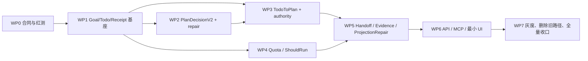

# LoopX 长程治理语义原生移植：分阶段实施计划

- 状态：WP0–WP7 repository implementation complete；local race/browser gates complete；real Provider/Remote Host gate pending
- 目标合同：[loopx-native-governance-goal.md](../product/loopx-native-governance-goal.md)
- 当前事实：[system-architecture-handbook.md](system-architecture-handbook.md)
- 决策留痕：[2026-09-01-loopx-native-governance.md](../../notes/implemented/architecture/2026-09-01-loopx-native-governance.md)

## 1. 执行原则

1. 文档和机器契约先于实现；任何范围变化先回流目标合同。
2. 每阶段一个任务分支/worktree；不把其他会话脏文件混入。
3. 新功能只增加一条权威链，不新增 `.loopx` 文件库、第二 Scheduler、第二 Runner Lease 或第二事件库。
4. 新迁移只进入 `agent-team-workbench/migrations/`；本 Goal 的治理迁移范围为 `0024`–`0035` 与 `0039`–`0042`。`0036`–`0038` 与本 Goal 同分支交付，但属于独立的 Agent config / idempotency 加固，不改变治理迁移范围。
5. 先写失败断言，再写实现；每个 bug/故障注入至少一条防回归钉子。
6. 本地跑触面检查；阶段/PR 窗口再跑全量 CI。
7. 迁移期 consistency 路径必须带删除阶段和 telemetry，不转化为永久兼容层。
8. 每阶段完成后停在分支，等待用户明确授权提交/合流。

## 2. 不可违反的不变式

- Goal/Todo 拥有意图；WorkItem/Plan/Run 拥有执行；TaskSession/Runner Lease 拥有 Provider/进程续接。
- Todo 不能直接创建 Run，只能经 `TodoToPlanCompiler → SubmitPlan`。
- `transitionRunLocked` 和远程 Runner event 原子入口仍是 Run 推进权威。
- TurnReceipt append-only；projection repair 不创建或改写 canonical receipt。
- Goal/Todo/Receipt/Quota 变更与 canonical event/outbox 同事务。
- Quota spend 使用 per-run delta、整数单位、固定 price digest；重放不重复 spend。
- 根 blocker 必须在同一事务同步 WorkItem、Coordinator、Goal、当前 Todo 并释放 claim；显式 unblock 恢复 Goal/Todo、保持 turn watermark 并开启新 repair 周期。
- 缺 Goal/当前 Todo 的受管系统 Coordinator fail closed，不调用普通/legacy `SubmitPlan`，不伪造 TurnReceipt/TurnSeq。
- terminal `canonical_usage` 只能绑定终态 Run；0035 的 SQLite trigger 与 Go repository guard 双重执行该边界。
- Evidence 只引用权威实体或 validation result；Agent 自报不构成完成证明。
- 用户 Accept 仍是最终完成门。
- 任何阶段不得让 Web 或 MCP 自行重算治理状态。

## 3. 依赖图



WP2 可以在 WP1 最小 Receipt/Attempt 表完成后立即开始；WP3/WP4 可在不写同一文件的前提下并行。

## 4. WP0：合同冻结与红测

### 目标

在业务执行路径修改前，把 R0–R8、AC-01–AC-15 转为机器契约和红绿测试矩阵。

### 交付

- `contracts/control/plan-decision-v2.schema.json` canonical JSON Schema。
- Goal/Todo/Receipt/Quota/Handoff 的 `x-lifecycle: proposed` OpenAPI DTO。
- 未挂 live channel、`x-producer-status: absent` 的 AsyncAPI event 草案；没有 producer 前不得进入 domain/live enum。
- 新 migration 与 Domain/Application 的 schema/behavior 红测矩阵；可执行测试在对应 WP 的第一刀落红并立即实现到绿，不把支线长期停在故意失败状态。
- Adapter capability 词汇：`structured_transport`、`schema_constrained_output`、`control_tool_call`。

### 必须钉红

- Envelope/step 未知字段拒绝。
- 五个 verb 的必填、禁止字段和界限。
- `json`/错误 fence 不走旁路执行。
- repair attempt 持久、达到 2 次才 blocker。
- Goal/Todo/Receipt identity 重放/冲突。
- Receipt Header/Phase append-only、RFC8785 digest、Todo CAS turn_seq；projection repair 不生成 Receipt。
- quota reservation/commit/release 幂等。
- price digest、per-run `input_tokens_total` 准入口径、四个 billable buckets、cache 不重复计费和 `usage_unresolved`。
- Todo 不得绕过 `SubmitPlan` 创建 Run。

### 验证

```bash
cd agent-team-workbench
go test -count=1 ./internal/application ./internal/httpapi ./internal/runtime
go test -race -count=1 ./internal/application ./internal/httpapi ./internal/runtime
go build ./...
go vet ./...
python3 -c 'import json; json.load(open("contracts/control/plan-decision-v2.schema.json"))'
```

### 退出门

- 契约文件可解析。
- schema shape、live/proposed 隔离、跨 OpenAPI/AsyncAPI 词汇与 capability 名称门禁全绿。
- 后续 WP 的目标测试先因对应功能未实现而红，不因 fixture/路径错误而红；同一 WP 收口时必须转绿。
- 字段、状态、错误码不存在未裁决歧义。

### 回滚

仅文档/契约/红测；不触碰生产路径，可直接撤销本阶段分支。

## 5. WP1：Goal / Todo / TurnReceipt 持久基座

### 目标

建立治理层最小 domain/persistence，先作 consistency-only 投影，不改变现有 Task 执行。

### 建议文件

- `internal/domain/governance.go`
- `internal/domain/turn_receipt.go`
- `internal/application/goals.go`
- `internal/application/todos.go`
- `internal/application/turn_receipts.go`
- `internal/persistence/sqlstore/governance.go`
- `migrations/0024_native_governance.sql`（治理基座；后续治理迁移按本计划列出的固定版本落入同一目录）

### 表/约束

- `goals`：workspace、root_work_item、status、phase、acceptance、budget、current_todo、version。
- `goal_todos`：class/status/instruction/acceptance/resume/priority/scope/claim/version。
- `turn_receipt_headers`：append-only `(goal_id,todo_id,turn_seq)`、schema/input digest、created_at。
- `turn_receipt_phases`：append-only `(goal_id,todo_id,turn_seq,phase_seq)`、phase、RFC8785 payload digest、Plan/Run/evidence/quota refs。
- `governance_events` 不单独建表；使用现有 canonical event/outbox。
- Goal ↔ root WorkItem 首版一对一唯一索引。
- Todo admission 以 version CAS 从 1 分配单调 turn_seq；同 client key 重放返回同 turn_key。
- Header/Phase identity 唯一且不允许 UPDATE/DELETE；同 identity 同 digest 幂等、不同 digest 冲突。

### 实施

1. Domain 状态机与 validation。
2. SQLite fresh/upgrade migration。
3. Repo CAS/append-only trigger。
4. Service create/get/list/start/pause/resume/cancel；start 初期只创建 consistency Todo，不派活。
5. 从现有 root Task/Coordinator 事件生成可重建 consistency projection。

### 测试

- Goal/Todo 状态机全边。
- claim 竞态恰有一个胜者。
- Header/Phase same identity/same digest 幂等、different digest 冲突。
- concurrent admission 只分配一个 turn_seq；UPDATE/DELETE receipt trigger 拒绝。
- Task/Chat 隔离、workspace 作用域、terminal guard。
- fresh DB、0023 upgrade、migration rerun。

### 退出门

- AC-01、AC-06、AC-08 的持久化前半段成立。
- 重启后 Goal/Todo 可重建且不影响既有 Run。
- consistency projection 与 root Task 状态分歧可观测，不能静默覆盖。

### 回滚

该阶段表无执行权；WP3 后由 compiler 获得意图层权威，但 Plan/Run 仍只由原执行链写入。

## 6. WP2：PlanDecisionV2 与 bounded repair

### 目标

把 Planner→Control Plane 从 Markdown fence 后验解析改为版本化 typed decision，并先解决 JSON/Schema 错误需要人工 unblock 的问题。

### 建议改动

- `internal/domain/plan_decision.go`
- `internal/application/plan_decisions.go`
- `internal/orchestrator` 增 control decision contract。
- Run input 固化 schema version/capability/repair attempt。
- Codex/Kimi/DSH Adapter 分别报告真实 output capability。
- Coordinator state/TurnReceipt 记录 repair decision 和 validation errors。

### 路径优先级

1. Provider 原生 schema constrained output。
2. 同一 final text 进入严格 decoder。
3. 失败后同 session `repair_plan`，最多 2 次。
4. 耗尽后精确 blocker。

不得把 `stream-json` 当原生 schema，不接受未知字段，不用 regex 清洗后直接执行。

### 错误与 telemetry

- syntax/schema/semantic/authority/quota 五类错误分别计数。
- 记录首次成功率、repair 成功率、repair 后 blocker、用户 unblock。
- 生产 Coordinator 不再维护 fence 命中或兼容解析指标；历史形态输入只能进入严格候选判定，格式错误走有界 repair。

### 测试

- Schema fixtures 与 Go decoder 双向一致。
- 每个 verb 正/反例、size bounds、additionalProperties。
- Provider native 与 translated path 进入同一 decoder。
- repair attempt 跨重启保持，重复终态 hook 不多开 repair。
- repair 成功只创建一个 Plan；耗尽 blocker 精确。
- 未识别 `json` fence 进入 repair，不进入 `SubmitPlan`。

### 退出门

- AC-02–AC-05 全部绿。
- 真实 Codex 与 Kimi 各完成一条合法 decision 和一条 repair。
- 格式类错误不再直接要求用户 unblock。

### 回滚

实施期曾有候选开关；最终实现未保留 `control_decision_mode` 或双轨 parser，生产 Coordinator 直接执行唯一 typed decision 路径。缺少 Goal/当前 Todo 时直接 fail closed，不转普通/legacy `SubmitPlan`。

## 7. WP3：TodoToPlanCompiler 与 Authority

### 目标

让 Todo 成为 bounded intent，并通过唯一编译边界复用现有 Plan 执行器。

### 实施

- `TodoToPlanCompiler` 只输出 `PlanStepInput`/强类型等价物，不调用 Dispatcher。
- Authority 校验 Goal/Todo state、claim、decision scope、workspace、Agent、Runtime capability、ExecutionContext。
- `DecisionScope.AgentIDs` 是 claim/dispatch 共用 allowlist；StartGoal 创建初始 Todo 时冻结 Coordinator + enabled Worker roster，compiler 不按当前 roster 静默扩权。
- compiler result、schema digest、source Todo/TurnReceipt 写进 Plan/Run input 和事件。
- Plan client key 包含 Goal/Todo/turn identity。
- 现有 `SubmitPlan` 继续负责 barrier、guardrails、child/dispatch/run 的原子创建。

### 测试

- Todo→五动词映射与拒绝矩阵。
- scope 越权、disabled Agent、系统 Coordinator 作为 Worker、错误 child/join 拒绝。
- duplicate compiler replay 不重复 Plan/Run。
- compiler/SubmitPlan 中途失败整事务回滚。
- Goal/Todo 与 WorkItem/Plan 权威边界测试。

### 退出门

- AC-05、AC-08 的执行部分成立。
- 一个 Goal 可以由 Todo 驱动现有完整 Task 生命周期。
- 没有第二条直接 Run 创建路径。

### 回滚

若需回滚 compiler，停止新 Goal admission；已有 Receipt/Quota 保持只读审计，不恢复第二 parser。

## 8. WP4：Quota / ShouldRun

### 目标

在 Run 创建前建立跨 Turn 的幂等预算准入和结算。

### 建议文件/表

- `internal/domain/quota.go`
- `internal/application/quota.go`
- `internal/persistence/sqlstore/quota.go`
- `goals.quota_policies` JSON 是唯一 policy 真相源；不得再建可写 `goal_quota_policies` 第二表
- `quota_reservations`（key=`goal_id/todo_id/turn_seq/quota_kind`）
- `quota_spend_entries`（append-only）
- model registry 增版本化价格快照：`input_uncached_tokens`、`cache_read_tokens`、`cache_write_tokens`、`output_tokens` 各自的 `microusd` 单价。

### 实施

1. audit-only 与 enforce 使用同一计算；audit 只记录 `would_deny`，不阻止 Run。
2. `turn_count` 在 Coordinator Run 前预检，并在 Header admission 同事务建立、提交 reservation；成功 admission 后即使 Plan 后续失败也不倒扣。`active_worker` 直接读取现有 Run 真相源的瞬时 gauge，不伪造 reservation/spend；token/cost reservation 已与同一 Turn 的 source Run、Plan client key 和 decision digest checkpoint 绑定。
3. reservation 与对应 admission/Run client key 同事务；enforce deny 不留下 Claim/Header/Plan/Run/Dispatcher 部分副作用。
4. terminal usage 只接受 `usage_basis=per_run`：将 Provider 的 session cumulative usage 通过持久 anchor 先转换为 per-run usage，归一化为 `input_tokens_total`（仅用于总 token quota admission）以及四个 billable buckets：`input_uncached_tokens`、`cache_read_tokens`、`cache_write_tokens`、`output_tokens`；无法证明 anchor 或 per-run delta 时写 `usage_unresolved`。
5. `cost_microusd` 只按四个 billable buckets 与创建 Run 时固化的 price digest 做 checked integer arithmetic 和明确舍入：`input_uncached_tokens*input_price + cache_read_tokens*cache_read_price + cache_write_tokens*cache_write_price + output_tokens*output_price`；`input_tokens_total` 不参与 cost，禁止把已包含 cache 的总 input 再按 input 价格重复计价。
6. 幂等 commit/release；reconcile 只处理已证明的 gap。
7. enforce turn/token/concurrency/cost policy。

### 当前实施切片（WP4-A/B/C）

- 0027 已落 `quota_reservations` 与 append-only `quota_spend_entries`；reservation 冻结 policy/aggregate amount（不持单一价格），spend 要求 terminal Run、Goal Task 子树归属、canonical usage digest 锚定且同 reservation 多 Run 合计不超过 reserved amount；超容缺口落 unresolved（amount=0+reason），repo 层带「能落必须落」对偶拒绝。
- `turn_count` 是 committed reservation 累计值；同 Turn 重放不重复计数。Coordinator source Run 和 admission 都会执行 ShouldRun，防止额度耗尽后仍创建模型 Run。
- `active_worker` 是现有非终态 Worker Run 的 gauge，排除 system Task Coordinator；同一 Plan 多 Worker enforce deny 时整个事务回滚，audit 决策固化进 Run input。
- WP4-B：`RecordRunUsage` 同事务持久 latest ProviderUsageReport（同 digest 幂等、异 digest seq+1、canonical 冻结后拒改）；终态钩子用纯 `CanonicalizeProviderUsageV1` 生成 immutable canonical usage，session_cumulative 经 TaskSession per-kind watermark（同事务 CAS 推进）做差；受管 Run 无 report 时延迟到关闭性 sweep 合成全 unresolved absent canonical；cost 按 Run 固化的 price snapshot 二段制计算（桶缺/无价记 unresolved，不猜 0）。0035 进一步在 SQLite 侧禁止非终态写入 `canonical_usage(+digest)`，升级遇到既有违规会 fail closed。
- WP4-C：usage-kind reservation 在 admission 同事务冻结；Worker/eval/retry/heal Run 创建闸（enforce 下本 Turn 冻结容量为 0 即拒）；coordinator 预检覆盖全部启用 kind；cost 政策下无价模型创建即 `cost_price_unavailable`（audit/enforce 同）；终态 sweep 按确定性顺序逐 Run 落 spend、关闭 reservation（commit 实际/release 剩余）、phase5 存在时追加确定性 phase6；StartCoordinator 恢复面重放当前 Turn sweep。
- 0030 固化 source Run/plan client key/decision digest 恢复 checkpoint；永久 Plan/Run 拒绝在 phase3 记录 rejection，与 source spend、reservation 关闭和 Todo blocked 同事务提交；存储故障保留 `plan_commit` durable retry，不误报 semantic blocker。
- 0033 增加 evidence-bound `QuotaGapResolution`：只允许 `reconciled`，不提供 waiver；原 unresolved spend/canonical/reservation 不改，追加 amount 进入 committed 并继续参与 ShouldRun。
- 0035 增加 terminal-only canonical usage trigger；Run 未进入 `succeeded/interrupted/cancelled/lost/failed` 时不能拥有 canonical usage，既有违规不会被迁移静默放过。
- 0039–0042 收口 Todo completion identity、Handoff durable continuation/claim renewal、late-source fencing、settlement wake reroute、blocker checkpoint clear，以及六类 `TurnDecision` control receipt 的 phase 1–7 replay digest/补齐语义；`0036`–`0038` 保持为同分支独立 Agent config / idempotency 加固。
- 阶段证据：application/domain/sqlstore/migrate 普通测试全绿；race 与真实 Provider/Host 验收见 §12 表格。

### 故障注入

- reservation 后事务回滚。
- Run 已建、终态前崩溃。
- terminal 已落、spend 未 commit。
- spend commit 后 outbox 未发布。
- duplicate terminal hook/outbox replay。
- cumulative usage 无 anchor、per-run delta 无法证明、cache read/write 无法拆分且价格不同、price missing、checked arithmetic 整数溢出。

### 退出门

- AC-07 全绿。
- audit 与 enforce 模式对同一输入给出同一决策。
- 仅对已启用的 quota kind：超额或 usage/price 不可证明时不创建新 Run；未启用该 kind 的 Goal 不被误阻塞，已有 Run 不被破坏。

### 回滚

enforce→audit；已提交 spend 不删除、不回写零，只停止后续准入。

## 9. WP5：Handoff / Evidence / ProjectionRepair

实现状态：code-complete。0029 已落 Handoff aggregate、原子 claim transfer、ValidationResult、Evidence freshness/scope gate、可重建 projection 与 repair record；Delivery Brief 通过 0032 不可变 snapshot 进入 evidence；Artifact accepted 通过 0034 变为单向审批终态。0039–0042 进一步落地 Handoff durable continuation、same-generation claim renewal、late-source Plan fence、settlement wake reroute 与 blocker 后 checkpoint clear；waiting Plan 被 supersede 时，旧 Plan 的 pending manual dispatch approval 同事务过期，迟到审批不再创建 child Run。

### 目标

补齐长期 Goal 的所有权交接、证据门禁和可重建治理投影。

### 实施

- Handoff record：source/target/Todo/reason/context/evidence/claim transfer/acceptance。
- Target 接受并 claim 后才释放 source。
- Continuation 只克隆 state 当前受保护 source Run；支持精确上一跳的二次 Handoff，无当前 Run 则明确 fresh。
- Handoff accept 围栏 source 后续 PlanDecision/evaluation verdict；已持久 settlement wake 在消费时重路由到当前 target。
- Evidence 引用 WorkItem/Plan/Run/Artifact/Approval/Brief/validation ID。
- Goal/Todo progress 和 timeline 从 canonical receipt/event 投影。
- ProjectionRepair replay receipt/event；记录 repair receipt，不改历史 receipt。
- finish gate 检查验收标准、validation Todo、evidence freshness 和人工 Accept。

### 测试

- handoff 竞态、拒绝、target missing、session fresh/resume 分离。
- Evidence 缺失/过期/Agent 自报拒绝。
- projection 删除后重建结果一致。
- canonical receipt mutation/forgery 被拒。
- repair 幂等、失败升级 user_action。

### 退出门

- AC-09–AC-11、AC-15 全绿。
- 换 Agent/Runtime 后能凭 evidence/receipt 继续，不读取旧会话聊天考古。

## 10. WP6：API、MCP 与最小 UI

实现状态：code-complete。Goal/Todo/Receipt/Quota/Handoff/Evidence/Projection/metrics 已进入 workspace-scoped REST；MCP 只走 Service 的查询与受限 claim/release/user-action，不暴露 restricted Delivery Brief snapshot；Task detail 已有 GovernancePanel 和 SSE invalidation。Quota gap reconciliation 只通过 Approval-only REST 写入，MCP 不开写命令。REST/MCP 的集合字段统一把空集合编码为 `[]` 而非 `null`，避免前端把合法空结果当加载失败。

### API/事件

- Goal list/get/start/pause/resume/cancel。
- Todo list/claim/release/resolve-user-action。
- TurnReceipt/Quota/Handoff/Evidence 查询。
- OpenAPI problem/error、Idempotency-Key、RBAC。
- AsyncAPI canonical events 与 SSE invalidation。

### MCP

- 只读 Goal/Todo/Receipt/Quota。
- 受限 claim/release/user-action。
- 必须调用 Service；禁止直改 governance 表。

### Web

- 新 stores 只消费服务端 read model。
- Task detail 增 Goal summary、当前 Todo、Quota、TurnDecision、下一动作、Handoff/Evidence 链接。
- 保持一条 Task timeline，不复制 Goal timeline 与 Run timeline。
- 首版无完整图编辑器、无拖拽 Todo DAG。
- 空 Goal/Todo/Quota/Receipt/Handoff/Evidence/Projection repair 集合在 REST/MCP 中保持数组形状；HTTP 回归测试覆盖 `[]` 合同。

### 退出门

- AC-12、AC-13 全绿；真实浏览器已在 1440 与 1024 宽度验证治理状态链一致。
- workspace generation/SSE reset/404/410/权限错误不污染其他 workspace。
- UI 不重算 Goal progress、quota 或 evidence pass。

## 11. WP7：灰度、删除旧路径与全量收口

### 已执行顺序

1. consistency-only projection。
2. 单 workspace typed decision comparison。
3. 单 workspace compiler enforce。
4. quota audit→enforce。
5. handoff/evidence gate。
6. 默认新路径。

实现状态：默认新路径已生效；生产代码中 `control_decision_mode`、fenced-plan 主解析和 governance `shadow` 命名已清零。受管系统 Coordinator 缺少 Goal/当前 Todo 时 fail closed，绝不转普通/legacy `SubmitPlan`；不提供可执行的兼容路径。六类 `TurnDecision` 均走 phase 1–7 control receipt，replay 严格比较输入 digest；Todo completion identity 绑定最新 admitted Turn 与精确 Receipt Header。

本轮收口还补齐了控制线一致性：根 WorkItem/Coordinator/Goal/current Todo 的 blocker 与 claim 释放同事务、同事件/outbox；显式 unblock 恢复 WorkItem、Goal active、Todo pending，保持 `last_turn_seq`、不复用旧 claim，并清除 exhausted repair checkpoint。根 blocker 同时 sweep 该 root 的全部 open Dispatch，CAS 关闭为 `degraded`；兄弟 Run 的迟到终态、并发 blocker 和恢复重放不会复活或重复发事件。

`session_unknown` self-heal 的 lifecycle 校验、anchor 墓碑、deterministic Run 和 durable dispatch claim 同事务；控制面启动先恢复 pending self-heal，再运行 generic orphan 收敛。paused Goal 延迟到 Resume，blocked/cancelled 不会被恢复面越权分派。

本地浏览器验收在 1440 与 1024 宽度已完成：GovernancePanel 的 Coordinator/Goal/Todo blocker 状态与治理链一致，空集合可渲染，横向溢出探针通过。截图证据见评审文档的 [`assets/`](../review/assets/) 目录。

### 删除清单

- 旧 fenced-plan 主提取路径与旧 prompt 合同。
- 迁移期 `control_decision_mode` 和 shadow-only 字段。
- 无消费者 metrics/events/DTO。
- 临时双读/双写与 compatibility parser。
- 用完的 mission/state 工件。

### 全量验证

```bash
cd agent-team-workbench
test -z "$(gofmt -l .)"
go vet ./...
go build ./...
go test -race -count=1 ./...
go test -count=1 ./cmd/migrate
go run ./cmd/migrate -dsn "sqlite://<temporary-db>"

cd web
pnpm tsc -b
pnpm test
pnpm lint
pnpm build
```

真实验收（本地 UI gate 已完成；以下仍需真实外部环境的部分）：

- Codex 与 Kimi 各跑完整 Goal。
- syntax/schema/semantic repair。
- CP 重启、Runner 断线/boot 变化、session_unknown。
- quota crash points。
- handoff、evidence 缺失、projection repair。
- 人工 Return/Accept 与 comment 竞态。

### 退出门

- AC-01–AC-15 全部有证据。
- 新旧路径分歧为零，旧路径删除。
- 架构事实源、目标合同、decision note 与源码一致。
- CI 全绿，真实 UI/Host/Runtime 验收通过。

## 12. 阶段证据与进度记录

每个 WP 在本文件维护：

| WP | 状态 | 分支 | 关键证据 | 剩余风险 |
|---|---|---|---|---|
| WP0 | completed | `codex/research-loopx-task-foundation` | canonical PlanDecision schema、OpenAPI/AsyncAPI lifecycle 和 capability 词汇门禁已落 | 真实 Provider schema 能力为外部 gate |
| WP1 | completed | `codex/research-loopx-task-foundation` | 0024/0039 Goal/Todo/Claim/Receipt/completion identity，JCS digest、CAS、restart/consistency 测试；四层 blocker/unblock 同事务同步 | 无 repository 缺口 |
| WP2 | completed（external gate pending） | `codex/research-loopx-task-foundation` | raw PlanDecisionV2 strict decoder + 2 次 durable repair；fenced parser 已删 | 真实 Codex/Kimi valid+repair |
| WP3 | completed（external gate pending） | `codex/research-loopx-task-foundation` | 0026 immutable lineage，TodoToPlanCompiler 唯一经 SubmitPlan，authority/replay/crash 测试 | 真实 Host Goal 生命周期 |
| WP4 | completed（external gate pending） | `codex/research-loopx-task-foundation` | 0027/0028/0030/0033/0035；canonical usage、anchor、price、quota、Plan abort compensation、evidence-bound reconciliation、terminal-only trigger | 真实 Provider usage 和 Remote settlement |
| WP5 | completed | `codex/research-loopx-task-foundation` | 0029/0032/0034/0040；Handoff、durable continuation、claim renewal、multi-hop/exact-source/late-result fence、settlement reroute、blocker clear、ValidationResult、Evidence/finish gate、ProjectionRepair、immutable Brief snapshot、Artifact accept；supersede approval expiry | 真实 runtime Handoff 仍属外部 gate |
| WP6 | completed | `codex/research-loopx-task-foundation` | REST/MCP/SSE/metrics/GovernancePanel；workspace scope、RBAC、idempotency、空集合 `[]` 合同；1440/1024 浏览器截图与无横溢 | 真实 Remote runtime UI path |
| WP7 | completed（external gate pending） | `codex/research-loopx-task-foundation` | 旧 control parser/switch 删除；四层 blocker/unblock 与 root dispatch sweep；全包普通/race、Go build/vet、Web type/test/lint/build、浏览器已绿 | real Provider/Host/usage gate |

状态只能由验证证据推进；Executor 自报不改变状态。架构/目标变更先更新相应文档，再修改本计划。

## 13. Goal 完成审计

最终完成前逐项核对：

- 目标合同 R0–R8。
- AC-01–AC-15。
- 本计划 WP0–WP7 的退出门和删除清单。
- 当前工作树、CI、迁移、真实 Runtime/Runner/UI 证据。
- 用户授权的提交、合流和 worktree 清理状态。

任何证据缺失都保持 Goal active，不以“代码大致完成”替代完成审计。
