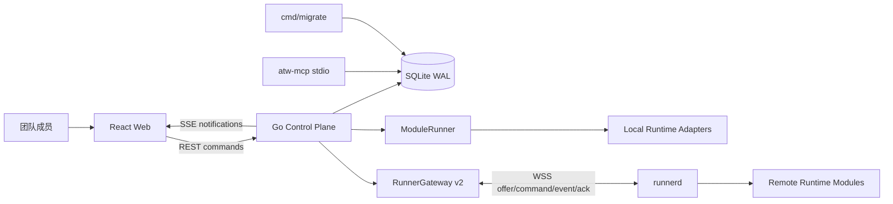

# Agent Team Workbench 系统架构事实源与源码导航

- 状态：current-state handbook
- 证据基线：`main@82665d8` + `codex/research-loopx-task-foundation` 当前未提交支线，2026-09-03 复核
- 用途：冷启动导航、架构评审、变更定位与后续 LoopX 治理语义原生移植的事实底座

## 1. 本文权威边界

本文只描述当前源码已经实现的事实，不提前把目标设计写成现状。发生冲突时按以下顺序裁决：

1. 当前领域模型、迁移、应用用例与机器契约。
2. 当前集成测试和 CI 门禁。
3. 本文与其他活跃架构文档。
4. 历史 note、归档评审和原型。

详细专题仍以现有文档为准：

- [C4 容器图](c4-container-diagram.md)
- [执行上下文、任务反馈与验收读模型](task-control-surface-context-design.md)
- [产品最终目标](../product/end-goal.md)
- [系统 Task Coordinator 决策](../../notes/implemented/architecture/2026-08-30-system-task-coordinator.md)
- [LoopX 任务底座评估](2026-09-01-loopx-task-foundation-architecture-assessment.md)

## 2. 从哪里开始读

| 要解决的问题 | 首读文件 | 下一步 |
|---|---|---|
| 控制平面如何装配 | [`cmd/control-plane/main.go`](../../agent-team-workbench/cmd/control-plane/main.go) | `application.Service`、Dispatcher、Runtime Registry |
| 一条业务命令怎样落库 | [`internal/application/service.go`](../../agent-team-workbench/internal/application/service.go) | 对应用例文件、`Store.InTx`、domain 状态机 |
| Task/Run/Plan 谁是权威 | [`internal/domain/`](../../agent-team-workbench/internal/domain) | WorkItem、Run、Plan、Dispatch、TaskCoordinator |
| Goal/Todo/Receipt 如何持久 | `internal/application/governance.go` | `domain/governance.go`、`sqlstore/governance.go`、迁移 0024 |
| 数据表和事务 | [`internal/persistence/sqlstore/store.go`](../../agent-team-workbench/internal/persistence/sqlstore/store.go) | `migrations/` 与各 Repo |
| 本地 Runtime 执行 | [`internal/runtime/module.go`](../../agent-team-workbench/internal/runtime/module.go) | SPI、Registry、具体 Adapter |
| 远程 Runner 执行 | [`internal/runnergateway/`](../../agent-team-workbench/internal/runnergateway) | `cmd/runnerd`、Runner v2 contract |
| 前后端协议 | [`internal/httpapi/server.go`](../../agent-team-workbench/internal/httpapi/server.go) | OpenAPI、AsyncAPI、Web stores |
| 用户看到什么 | [`web/src/App.tsx`](../../agent-team-workbench/web/src/App.tsx) | tasks pages、stores、API/SSE |
| 恢复和卡死排查 | `application/runs.go`、`coordinator_engine.go`、`reconcile.go` | Scheduler、Runner lease、终态 hooks、root blocker dispatch sweep |

## 3. 容器与进程边界



### 3.1 Control Plane

[`cmd/control-plane/main.go:87-228`](../../agent-team-workbench/cmd/control-plane/main.go) 负责：

- 打开 SQLite、构造 `sqlstore.Store`、SSE Hub 与 `application.Service`。
- 注册 Runtime Modules 与 Manifest/Probe Registry。
- 装配 Snapshot Resolver、ModuleRunner、RunnerGateway 和 chain Dispatcher。
- 启动 Outbox、Scheduler、Coordinator recovery 与 HTTP 服务。

`application.Service` 是用例和事务边界，不是领域真相；命令惯例是“校验 → domain 状态机 → 同事务写状态/事件/outbox → commit 后通知或分派”（`service.go:19-20`）。

### 3.2 SQLite

[`sqlstore.Open`](../../agent-team-workbench/internal/persistence/sqlstore/store.go) 强制 SQLite、foreign keys、5 秒 busy timeout、WAL，并将进程内 DB 写串行到一个连接。`Store.InTx` 把 `*sql.Tx` 放进 context，所有 Repo 自动复用同一事务（`store.go:194-208`）。

### 3.3 本地与远程执行

- `host_local` 由进程内 [`runtime.ModuleRunner`](../../agent-team-workbench/internal/runtime/module.go) 执行。
- 非本机 Snapshot 由 [`RunnerGateway`](../../agent-team-workbench/internal/runnergateway) 精确路由到对应 Host/Runner。
- 禁止跨 Host 或远程到本机静默回退；Snapshot 或 Host 解析失败必须 fail-closed。

### 3.4 MCP

[`cmd/atw-mcp`](../../agent-team-workbench/cmd/atw-mcp/main.go) 独立打开同一 SQLite，只提供任务看板查询和受限 claim/return；其 Service 使用 no-op Dispatcher/Notifier，不派发 Run、不推 SSE，因此不是第二控制平面。

## 4. 分层与包职责

| 层 | 主要目录 | 职责 |
|---|---|---|
| Domain | `internal/domain` | 实体、状态机、错误、不变式；不依赖 HTTP/SQL/Adapter |
| Application | `internal/application` | 用例、事务编排、事件、恢复、读模型 |
| Persistence | `internal/persistence/sqlstore` | SQLite Repo、CAS、事件/outbox、幂等 |
| Governance integrity | `internal/governance` | RFC 8785 canonical JSON 与 Receipt digest 验证；不拥有状态 |
| Runtime | `internal/runtime` | SPI、ModuleRunner、Manifest/Probe、Adapter |
| Remote execution | `internal/runnergateway`, `cmd/runnerd` | Runner 连接、offer、lease/fence、event/ACK |
| Scheduling | `internal/scheduling` | timer/heartbeat/on-demand/assignment wakeup |
| Context | `internal/hostregistry`, execution context domain/application | Host/Location/Snapshot 解析与可信 CWD |
| Interfaces | `internal/httpapi`, `internal/mcpserver` | REST/SSE/problem/RBAC 与 MCP |
| Projection | `internal/sse`, `internal/outbox`, Web stores | 通知、补发、失效重拉和 UI read model |
| Configuration | `internal/agentconfig`, `internal/modelconfig`, `internal/agentwork` | Agent/模型/凭据/项目运行目录 |

## 5. 单一真相矩阵

| 概念 | 权威状态 | 主要写入口 | 投影/消费者 |
|---|---|---|---|
| WorkItem | `work_items` + domain 状态机 | Create/Move/Block/Unblock/Accept/Return | Task API、Task tree、Review Queue |
| Plan | `plans` + `plan_steps` | `SubmitPlan`、审批续跑 | Plan API、Task detail |
| Dispatch | `dispatches` + members | Plan/用户派发、settlement | Dispatch timeline |
| ExecutionRun | `execution_runs` + `run_events` | `createRunLocked`、`transitionRunLocked` | Transcript、attempts、Brief |
| TaskSession | `task_sessions` | Run 创建 claim、session callback | resume/rotate/fresh 决策 |
| TaskCoordinator | config/state/events tables | Start/terminal/recovery/comment control line | Coordinator snapshot/timeline |
| Goal | `goals` + Goal 状态机 | Governance Service、startup/root consistency ensure | 长期意图与当前 Todo 投影 |
| Todo/Claim | `goal_todos` + Todo 状态机/CAS | Start/Claim/Release/Cancel/Admit | bounded intent、DecisionScope、治理所有权 |
| Root blocker synchronization | WorkItem + Coordinator + Goal + current Todo/Claim | `blockCoordinator`、`BlockWorkItem`、`UnblockWorkItem` 同事务 helper | 四层状态、claim 与 open Dispatch 的一致性事件 |
| TurnReceipt | append-only Header/Phase tables | `AdmitTurn`、`AppendTurnReceiptPhase` | durable writeback、replay/recovery 证据 |
| Quota reservation/spend | `quota_reservations` + append-only `quota_spend_entries` | admission/Run 创建闸冻结 reservation；终态 sweep 落 spend 并关闭 | ShouldRun 准入、phase6、容量不变式 |
| Quota gap resolution | append-only `governance_quota_gap_resolutions` | Approval-only evidence-bound reconcile | 原 unresolved 不改；追加 amount 进 committed/ShouldRun |
| Canonical usage | `execution_runs.canonical_usage(+digest)` immutable、terminal-only | 终态钩子 `canonicalizeRunUsageLocked` 唯一写点；0035 SQLite trigger 兜底 | quota spend 的 usage_digest 锚、成本二段制 |
| Provider usage anchor | `task_sessions.provider_usage_anchor(+seq)` | canonicalize 事务内 CAS 推进 | session_cumulative → per_run 差量基线；分量回退/覆盖缺口/身份不兼容时不推进 |
| ExecutionContext | Host/Location/WorkItemContext/Snapshot tables | Context API、Run 创建冻结 | Dispatcher、Runner、Brief |
| TaskComment | append-only comments + root cursor | comment/return/unblock | Coordinator durable turn |
| Approval | approvals + grants | Runtime/Plan request、resolve | Adapter forwarding、UI |
| Event | stream_events + outbox | `Service.emit` | SSE、invalidate/refetch |
| Artifact | artifacts | Run artifact recording + Approval-only accept | Delivery Brief / Evidence；accepted 为单向终态 |
| DeliveryBrief | 实时聚合 + immutable snapshot 表 | 服务端 read transaction；snapshot capture | Review UI / evidence finish gate |

### 5.1 WorkItem

[`domain/workitem.go:28-73`](../../agent-team-workbench/internal/domain/workitem.go) 定义 `todo / in_progress / blocked / completed / cancelled`。`completed` 只能经 Accept；review/acceptance 是 phase 投影。执行锁归 Run，不归 Agent。

### 5.2 Plan

[`application/plan.go:73-293`](../../agent-team-workbench/internal/application/plan.go) 是权威写入口：校验 owner/source/Coordinator、guardrails、dispatch 后等待屏障；waiting 旧 Plan 可同事务 supersede，并在同一事务将其 pending manual dispatch approval 置为 expired。dispatch 步在同事务创建 child WorkItem、Dispatch、queued Run，commit 后才调用 Dispatcher。

治理编译产生的 Plan 额外固化 immutable `client_key + (goal_id,todo_id,turn_seq) + schema/decision digest`；同 workspace/client key 且同 digest 返回原 Plan，不再进入 active/supersede/dispatch，不同 digest 冲突。`source_run_id` 保留 Planner 因果，但不替代治理 Turn 身份。由 Plan 创建的 Worker/evaluation Run 在 `input.governance` 继承同一身份；它只是审计/结算锚点，不成为第二执行权限源。

### 5.3 Run

[`domain/run.go:8-45`](../../agent-team-workbench/internal/domain/run.go) 是 13 态状态机。终态不可逆，retry 必须新建 Run。`createRunLocked` 统一选择 Runtime/Model、冻结 Snapshot/Capability/Session Anchor；`transitionRunLocked` 是状态、事件、Task lock、presence 与 review 投影的唯一应用写入口。

### 5.4 Coordinator

每个根 Task 只有一条 durable Coordinator state；子任务通过 ancestry 回到根控制线。启动链为 `StartCoordinator → startCoordinatorTurn → createRunLocked`。终态链负责 bounded retry/fallback、Worker retry/replan、waiting_user/blocked/completed，并追加不可修改的 Coordinator events。根控制线进入 blocker 时，WorkItem、Coordinator、Goal、当前 Todo 和 claim 在同一事务同步，所有 root-owned open Dispatch 也由 CAS sweep 关闭；显式 unblock 在同一事务恢复 Goal/Todo，再由恢复循环开启新控制轮。

Planner 输出现统一进入 embedded canonical `PlanDecisionV2` schema 与强类型五分支 decoder；duplicate key、trailing JSON、非法 UTF-8、schema 与跨 step 语义分别 fail closed。syntax/schema 错误在原 Coordinator session/context/runtime 上创建最多两次持久 `repair_plan` Run；semantic/authority/quota 不消耗格式 repair 预算。Plan、decision audit 与 repair checkpoint 在 `SubmitPlan` 事务内同生共退，`source_run_id` 重放先于 active/waiting Plan 判定。

### 5.5 Native Governance

[`application/governance.go`](../../agent-team-workbench/internal/application/governance.go) 在 WorkItem 上方维护 Goal/Todo，但不拥有 Plan/Run：

- 公开 root Task 创建必须带 1–64 条验收标准，之后幂等 ensure；Control Plane 启动时逐 Workspace rebuild；历史 Task 缺少验收合同或 owner 时返回结构化 inconsistency，不猜值、不覆盖源 Task。
- ClaimVersion 跨 release/expiry 单调递增；Claim 是治理所有权，Runner lease 仍是执行权。
- `AdmitTurn` 是 Todo 进入 `running` 的唯一 Repo 路径：Todo CAS 分配 `turn_seq`，Header 同事务写入；generic Update 与 SQLite trigger 都禁止绕过。
- Header/Phase 由 `gowebpki/jcs` 做 RFC 8785 canonicalization + SHA-256，Repo 入口复算；同 identity/same digest 重放，different digest 冲突。
- initial Todo 的 DecisionScope 在创建时冻结 Coordinator + enabled Worker roster，claim/admission 后不可修改；后续 Agent roster 变化不扩权既有 Todo。
- 系统 Coordinator 有 Goal/current Todo 时进入 `TodoToPlanCompiler` fresh authority gate；缺 Goal 或当前 Todo 时在 Run 创建前 fail closed，阻塞控制线，不转普通/legacy `SubmitPlan`，也不强造治理状态。
- Quota 准入与结算：admission 同事务冻结 turn_count（立即 committed）与全部 usage-kind reservation（`reserved=limit−committed−active reserved`，跨 Turn 不超订）；`active_worker` 是 Run 真相源的瞬时 gauge，Worker/Worker retry 创建前同事务 gate；usage-backed 政策存在时 phase6 等待「该 Turn 全部受管 Run 终态 + 逐 kind spend 落账 + 无本 Turn pending retry + Plan 无 pending 步（manual 审批挂起不关闭）」后由 sweep 同事务关闭 reservation（commit 实际、release 剩余）并追加；cost 政策下无价模型在 Run 创建侧 fail-closed（`cost_price_unavailable`）。准入判定（ShouldRun 与创建闸）同时消费 unresolved 缺口：存在无法证明的 usage 结算即 fail-closed（audit 只记录），缺口不自动清除。无 report 的受管 Run 的 absent canonical 只在关闭性触发源（StartCoordinator/admission/Todo 收口/审批拒绝收口）合成；关闭前迟到的 report 正常首写真实用量，关闭后到达即越过结算边界、拒绝改写。`canonical_usage(+digest)` 只能存在于终态 Run，0035 的 SQLite trigger 与 Go repository guard 双重执行这一边界。plan_dispatch 审批被拒绝时在提交后关闭本 Turn 的 reservation（source 结算 + phase6）、Todo waiting→blocked、Coordinator blocked（plan_dispatch_rejected），不自动 replan。恢复面：三处终态钩子链 + StartCoordinator 每次调用都会重放当前 Turn 的 sweep。
- 永久 Plan/Run 拒绝在 phase3 记录 rejection，并与 source spend、reservation 关闭、Todo blocked 同事务提交；存储故障则保留 `plan_commit` retry checkpoint。Unresolved gap 只能通过 Approval-only、正面 Evidence 绑定的 append-only reconciliation 收口，v1 不提供 waiver。
- Handoff/Evidence/Projection/Quota/Receipt 等 live event 与状态写、`stream_events`、outbox 同事务；Web 只做 invalidation/refetch，不拥有治理状态机。

## 6. 核心调用链

### 6.1 根 Task 到完成

```text
POST WorkItem
  → CreateWorkItem transaction
  → root Task + Coordinator state/event
  → commit
  → StartCoordinator
  → Coordinator Run
  → final text
  → PlanDecisionV2 strict decoder
      syntax/schema → durable repair_plan（最多 2 次）
      semantic/authority/quota → explainable blocker
      valid + Goal         → claim/admit + TodoToPlanCompiler + receipt phase1–7
      missing Goal/Todo    → fail-closed blocker；不转普通/legacy SubmitPlan
  → SubmitPlan + receipt phase4–5（governed path）
  → child WorkItem + Dispatch + Worker Run
  → Worker terminal
  → maybeSettleDispatch
  → settlement wake / Coordinator summary
  → finish{evaluation:true}
  → evaluation Run / verdict
  → Review Queue / Delivery Brief
  → user Accept
  → WorkItem completed + Coordinator completed
```

关键源码：`service.go:455-623`、`coordinator_engine.go:165-250,686-907`、`plan_extract.go:81-150`、`plan.go:402-588`、`settlement.go:41-174`、`evaluate.go`。

### 6.2 Run 创建与分派

```text
CreateRun / Plan / Retry / Wakeup
  → createRunLocked
  → resolve WorkItem + agent + Runtime binding/model
  → resolve and persist immutable ContextSnapshot
  → capability/session decision
  → create queued Run + canonical event/outbox
  → commit
  → chainDispatcher
      host_local → ModuleRunner
      remote     → RunnerGateway offer
```

Snapshot、Run、会话决策和事件必须在分派副作用前提交；解析失败不能留下 queued Run。

### 6.3 远程 Runner

```text
runnerd connect/hello
  → enrollment + host/epoch/boot validation
  → run.offer
  → DB lease + fencing token
  → run.accept/reject
  → stable event_id + producer_seq
  → ApplyRunnerEvent transaction
  → lease/dedup/event/state/session/outbox
  → commit
  → ACK
```

Lease 真相在 SQLite；Runner 心跳按 epoch/boot 续租。事件断线重发必须保持 identity，去重与状态推进同事务。run_spec 携带 `agent_profile_id`（远程 adapter 构造 provider usage report 的身份前提）；`usage.updated` 帧可携带 sealed `provider_report`（provider-usage/v1），控制面校验 digest 后经 `recordRunUsageTx` 绑定 Run——malformed 或 digest 失配按毒帧收口（runner_event_invalid），不静默丢证据。终态事件同事务释放 lease；对终态后补发的 `usage.updated`（runnerd 断线重传场景）有严格例外：lease 已释放且 lease/runner/fencing 与该 Run 终态前租约逐字匹配才放行，其余 kind 不放行。

### 6.4 Session 与自愈

TaskSession 唯一键是 `(workspace, agent, adapter, task_key)`。配置 digest 与 Snapshot digest 组成 resume 指纹；配置、模型或执行上下文漂移必须 fresh/rotate。Provider 报 session missing 时 Adapter 返回 `session_unknown`，普通 Run 只允许一次 fresh self-heal，禁止静默 fresh。coordinated root 的历史 Worker 自愈必须带控制面内部 admission proof，精确绑定 failed `session_unknown` 源 Run、workspace/root/Agent 和 resume checkpoint；公开 `CreateRun` 不能伪造该能力。

自愈的生命周期检查、TaskSession 墓碑、deterministic `session-heal:<source_run_id>` Run 与 queued→starting dispatch claim 同事务。进程在 commit 与 Dispatcher 之间退出时，启动顺序是 legacy context 收敛 → pending self-heal 重投 → generic orphan 收敛；paused Goal 的 self-heal 保留到 Resume，blocked/cancelled 不分派。

### 6.5 反馈与验收

- TaskComment append-only，根 cursor 分配单调 revision。
- requirement/review_feedback 由 Coordinator 按 consumed watermark 在 Run 创建事务内消费。
- Return 写 review_feedback；Accept、Return、actionable comment 以 version/state 冲突保证只有一方成功。
- DeliveryBrief 只读聚合 WorkItem、Coordinator events、Runs、Artifacts 和 Comments；前端不得自行重算权威证据。

### 6.6 Governance 与 Receipt

```text
root Task create / Control Plane restart
  → Ensure/RebuildGovernanceState
  → Goal + initial Todo（无 Plan/Run/lease）
  → claim + AdmitTurn（同事务）
      Todo claimed→running + last_turn_seq++
      RFC8785 TurnReceiptHeader
      canonical event + outbox
  → decision_decode / validation / durable_writeback phase
  → TodoToPlanCompiler（只读 fresh authority，无 Dispatcher）
  → SubmitPlan（唯一 Plan/child/queued Run 写入口）
  → plan_compile / dispatch phase
  → Todo running→waiting；拒绝则 running→blocked
  → quota_spend / projection_outbox phase
  → replay same TurnKey/client key/input digest 补 phase gap，不重复 dispatch/spend
```

`repair / replan / user_action` 等无 Plan 结果也生成完整 phase 1–7 control receipt；若源 Run 已属于旧 Turn，先幂等结算旧 reservation，不把 usage 二次计入新 Turn。Todo 完成只能绑定最新 admitted `TurnKey` 与已验收 root WorkItem evidence，两个 identity 经 REST/AsyncAPI/Web 显式暴露。

`CheckGovernanceConsistency` 是只读分歧查询；存储错误上返，projection mismatch 返回 code/message，均不静默修写权威状态。

## 7. 事务、事件与 UI 更新

### 7.1 写命令

大多数 HTTP 写命令要求 `Idempotency-Key`。服务端 claim-first 写 `idempotency_keys`，hash 覆盖 method/path/body；活动占位同时持有 owner token 和 `claim_expires_at`，长命令必须 Renew。Complete/Release/Renew 都同时校验 token、request hash 与活动状态；失去 owner 后旧请求 fail closed，不能晚到覆写新 owner 结果。

### 7.2 Canonical Event / Outbox

`Service.emit` 在业务事务中同时追加 canonical stream event、可选 run event 与 outbox。Outbox publisher 至少一次发布；SSE 只是通知，补发仍从 SQLite 的 `stream_events` 读取。

### 7.3 Web

前端启动顺序是 workspace list → bootstrap → cursor → EventSource。REST 读取权威数据；SSE 触发局部更新或失效重拉。Workspace generation、event id、stream sequence 和 410 reset 防止跨 workspace/旧连接污染。治理 REST/MCP 的集合字段（Goal/Todo/Quota/Receipt/Handoff/Evidence/Projection repair 等）即使为空也编码为 `[]`，不把 `null` 当作异常形状。

Task detail 组合 Coordinator、Comments、Plan、Dispatch、Ledger、Delivery Brief 和 Run；这些 store 是服务器读模型投影，不拥有业务状态机。

## 8. Runtime 与 Adapter

Runtime SPI 由 Manifest/Probe 和 Module/Callbacks/ExecResult 构成。`ModuleRunner` 是进程内唯一执行面；Adapter 只能回报事件和 Outcome，不能直接改领域状态。

| Adapter | 执行形态 | Resume | 关键边界 |
|---|---|---|---|
| Codex app-server | 每 Run 独立 stdio JSONL | thread resume | steering/approval/interrupt 原生；structured output 仍是 translated |
| Kimi CLI | `kimi -p --output-format stream-json` | `-S` | approval 不可用；取消走进程组 |
| Kimi app-server | 受管或外部 KAP server | session resume | steering/approval/swarm |
| DSH | 长驻 `dsh web` HTTP+WS | session.jsonl | 网关跨 Run 共享；协议不报 cache-write 时 `input_tokens_total` 保持 unknown（不派生） |
| Claude Code | CLI stream-json | CLI resume | 权限原生、取消进程组 |
| Mock/Scripted | 进程内 | fixture | 协议与回归验证 |
| ZCode | probe-only | 无 | Execute 明确不支持 |

能力必须来自 Manifest，不按 provider 名称猜测。`stream-json` 是传输格式，不等同 provider 原生 schema-constrained output。

## 9. 配置真相源

| 配置 | 真相源 | 运行投影 | 风险 |
|---|---|---|---|
| Agent | 稳态为 `agents/workspaces/<workspace_id>/<slug>/`；未完成跨介质同步时以 `agent_profiles` + `agent_config_sync_intents` 为恢复权威 | `agent_profiles` 及 Codex/Kimi target | Agent CAS、event、intent 同事务；原子文件发布成功后才 applied，reload 先重放 pending intent 再允许文件导入 |
| Model registry | `models/registry.yaml` | 启动时 resolver | 文件内容决定可选模型 |
| Credentials | `.agent-work/credentials.local.yaml` | 只返回脱敏状态 | 必须 owner-only 权限，不进事件/UI |
| Host mounts | 本机 `host-registry.yaml` | execution host/mount read model | root 只在本机可信文件，不接受远程绝对路径 |
| Coordinator config | SQLite config table | 隐藏系统 Agent snapshot | Prompt/system identity 受 trigger/API 保护 |

原生治理语义后续只能接入这一配置与事务链，不能再增加 `.loopx` 文件真相。

## 10. API、契约与安全

- REST 路由在 `internal/httpapi/server.go`，由合同门禁与 OpenAPI 双向对齐。
- Web 契约：`contracts/web/openapi.yaml`。
- SSE 契约：`contracts/events/asyncapi.yaml`。
- Runner 协议：`contracts/runner/v2/schema.json`。
- RBAC guard 已存在，但当前角色固定为 demo owner；OpenAPI 声明 cookieAuth，真实认证 middleware 尚未实现。
- MCP 没有 HTTP session/RBAC 上下文，只能保持受限读/小写面。

Goal/Todo/TurnReceipt/Quota/Handoff/Evidence/Projection/metrics 已进入 Service + SQLite authority chain 和 workspace-scoped REST。MCP 只提供 Service-backed 查询与受限 claim/release/user-action；不提供 Handoff、ProjectionRepair、Delivery Brief snapshot 或 quota reconciliation 写命令。Task detail 的 GovernancePanel 只消费服务端 read model，SSE 只触发失效重拉。真实浏览器已在 1440 与 1024 宽度核验 blocker 状态链与治理链一致，未发现横向溢出；截图保存在 [`docs/review/assets/`](../review/assets/)。

## 11. 恢复矩阵

| 故障 | 当前恢复路径 | 终止边界 |
|---|---|---|
| Runtime transient failure | Coordinator 有界 retry/fallback | 预算耗尽 blocked |
| Worker retryable failure | 同 Worker 重试，再 replan/换 Agent | 尝试预算耗尽 blocked |
| session missing | `session_unknown` → 一次 fresh self-heal | 再失败走正常 retry/replan |
| Control Plane restart | orphan Run reconcile、terminal hook replay | 无法证明归属则 lost/failed |
| Governance restart | startup rebuild + root ensure；Receipt identity/digest replay | inconsistency 可查询，不自动覆盖源 Task |
| Runner disconnect same boot | connection epoch + pending event replay | lease 过期后收口 |
| Runner boot changed | 释放旧 lease，running reconnecting→lost | 不复活旧进程执行 |
| Scheduler create failure | wakeup requeue | blocked/terminal no-op |
| Plan JSON syntax/schema error | 同 session/runtime/context 的持久 `repair_plan`，最多两次 | exhausted 后 blocked；用户显式 unblock 开新预算 |
| Plan semantic/authority/quota error | 不创建部分 Plan/Run，精确错误族 blocked | 用户修正语义、权限或预算后 unblock |
| Markdown fence / bare JSON array | 不启用兼容解析；裸数组由 canonical decoder 明确拒绝并进入格式 repair，围栏/无候选文本同样进入格式 repair | 不得绕过 strict decoder 或创建 Plan |
| 缺 Goal/当前 Todo | 治理状态检查失败即阻塞系统 Coordinator | 不转普通/legacy `SubmitPlan`，修复治理合同后显式 unblock |
| 根 blocker | 同事务同步 WorkItem/Coordinator/Goal/current Todo，释放 claim，并 CAS sweep root 全部 open Dispatch 为 degraded | 并发/迟到终态不复活 Dispatch；unblock 开新控制周期 |
| waiting Plan 被 supersede | 同事务结束旧 Plan 并过期其 pending manual dispatch approvals | 迟到 approve/reject 不得创建 child Run |
| 非终态写 canonical usage | Go repository guard + 0035 SQLite trigger 拒绝 | 既有违规使迁移失败，不静默修正 |
| Read model gap | ProjectionRepair replay canonical Receipt/Event 并重建 | 权威实体缺失则 failed/user action |

## 12. 数据迁移时间线

`migrations/` 是 SQLite 唯一 DDL 真相：

- 0001–0005：基础实体、Runtime binding、Agent、Session、Wakeup。
- 0006–0010：Plan、source-run 幂等、knowledge、join/guardrails。
- 0011–0019：Activity、Grant、client key、Task lock、Agent event identity、Dispatch、Ledger、Search、record kind。
- 0020：系统 Task Coordinator。
- 0021：Execution Host/Location/Context Snapshot、Runner/Session generation。
- 0022：TaskComment/cursor。
- 0023：Runner event dedup v2。
- 0024：Goal/Todo/Claim 与 append-only TurnReceipt Header/Phase；无 quota/event 第二表。
- 0025：Task Coordinator PlanDecision repair checkpoint 与 protected prompt v2。
- 0026：治理 Plan client key、TurnKey、schema/decision digest 与 immutable/unique guards。
- 0027：治理 quota reservation 与 append-only per-Run spend ledger；Goal policy 继续只存 `goals.quota_policies`，未新增第二套 policy 表。
- 0028：`execution_runs` 增 immutable `canonical_usage(+digest)` 与可推进的 latest `provider_usage_report(+digest,seq)`；`task_sessions` 增 `provider_usage_anchor(+seq)` 承载 provider cumulative 基线（代际序号 CAS）；spend 的 `usage_digest` 必须与 terminal 受管 Run 的 canonical digest 相等。
- 0029：Handoff、ValidationResult、Governance projection 与 ProjectionRepair。
- 0030：governed Turn source/plan/decision recovery checkpoint；canonical amount SQL guard。
- 0031：`stream_events.aggregate_version` 与 outbox 回填，历史事件显式为 0。
- 0032：immutable Delivery Brief evidence snapshot。
- 0033：evidence-bound append-only quota gap reconciliation。
- 0034：Artifact accepted 单向终态 trigger。
- 0035：`canonical_usage(+digest)` terminal-only SQLite trigger；迁移升级遇到既有非终态违规直接失败。
- 0036：Agent config durable sync intent；Agent CAS/event/target snapshot 同事务。
- 0037：HTTP idempotency owner token、claim expiry 与 Renew fencing。
- 0038：已 applied Agent config intent 整行不可变。
- 0039：Todo completion identity、latest Receipt/evidence gate 与 terminal Todo 不可变；无法证明的 legacy completed row 升级 fail closed。
- 0040：delegated Handoff receipt source 与 same-generation claim renewal fencing。
- 0041：blocked root 重建允许 draft Goal 直接物化为 blocked。
- 0042：无 Plan control receipt 的 phase 4/5 语义，不放宽普通 Plan lineage。

历史迁移只表示当时增量。当前 Plan 动词必须以 domain/最新迁移为准；不能从 0006 的三动词约束推断当前能力。

## 13. 当前已知缺口

仓库内可闭环缺口已在本分支修复；当前保留项都有明确边界：

1. **真实认证不在本 Goal**：HTTP 运行时仍使用 demo role；新 API 已接 RBAC permission guard，但 cookie/session middleware 属独立安全项目。
2. **Planner Provider 原生门待真实验收**：PlanDecision decoder/repair 已落且生产 fenced parser 已删；当前 Adapter 如实声明 `schema_constrained_output=unavailable`，仍需真实 Codex/Kimi 各跑 valid + repair。
3. **Remote Host/Runner/Provider E2E 待外部环境**：本机无可用远程 Runner 与对应 Provider 凭据；不以 mock 或 in-process gateway 冒充。
4. **跨介质配置不是 2PC**：0036–0038 已用 durable intent、owner-fenced HTTP 幂等和原子文件发布收口，但 SQLite 与文件/Provider target 仍无共同提交协议；保证是可恢复、可重放，不宣称 exactly-once 跨介质原子性。

## 14. LoopX 原生语义的插入点与当前进度

本节只定位扩展 seam，不定义目标 schema；目标以用户确认后的目标文档为准。

| 待移植语义 | 当前 seam / 状态 | 不得越过的边界 |
|---|---|---|
| Typed PlanDecision | canonical schema、runtime decoder、bounded repair 已落；真实 Provider gate 待收口 | 不直接创建 Run，不绕过 Plan 原子校验 |
| TodoToPlanCompiler | fresh Goal/Todo/Claim/Scope/Run/Context authority + Plan client key + receipt phase1–7 已落 | compiler 只输出 Plan 输入；执行仍唯一经 SubmitPlan |
| Goal/Todo | 0024 + Domain/Repo/Service + consistency rebuild 已落 | 不复制 WorkItem 执行终态 |
| Claim/Scope | ClaimVersion/DecisionScope/CAS 已落 | 不新增 Runner lease 真相 |
| Quota/ShouldRun | 0027/0028/0030/0033/0035：准入、canonical usage、anchor、price、abort compensation、evidence-bound reconciliation 与 terminal-only trigger 已落 | 原 spend/canonical 不改；reconciled amount 仍参与 ShouldRun；非终态不能写 canonical |
| TurnReceipt | Header/Phase/JCS/replay/live events 已落 | 不建第二事件库 |
| Handoff | 0029 aggregate + 0040 continuation；target accept 后原子转 claim，source 终态后创建 delegated Coordinator Run，settlement wake 重解析当前 target | 不复制 Provider session history；source 迟到 decision 只作 evidence；blocker 清 checkpoint 但保留 Handoff 历史 |
| Evidence | ValidationResult、accepted Artifact、immutable DeliveryBrief snapshot 与 finish gate | 只引用权威实体 ID；人工 Accept 最终收口 |
| Projection Repair | 0029 repair record + canonical Receipt/Event replay + REST/UI | 不修改 Receipt 或终态 Run/Plan |
| Blocker/Unblock | `blockCurrentGovernanceLocked` / `resumeCurrentGovernanceLocked` + `closeOpenDispatchesForBlockLocked` | 四层状态与 claim 同事务；root 全部 open Dispatch 关闭为 degraded；unblock 不复用旧 claim/turn |

## 15. 验证入口

仓库 CI 入口：`.github/workflows/ci.yml`。

```bash
cd agent-team-workbench

# 后端
gofmt -l .
go vet ./...
go build ./...
go test -race ./...

# 迁移
go test -count=1 ./cmd/migrate
go run ./cmd/migrate -dsn "sqlite://<temporary-db>"

# 前端
cd web
pnpm tsc -b
pnpm test
pnpm lint
pnpm build
```

日常开发按改动触面执行 focused tests；PR/CI 窗口才全量收口。根 `tsconfig.json` 是项目引用，前端类型检查必须用 `tsc -b`。

## 16. 文档维护规则

- 新增/删除实体、表、进程、权威写入口或跨容器契约时，同一提交更新本文。
- 只改实现细节且不改变入口/权威/数据流时，不把本文变成逐函数清单。
- 架构取舍写 `notes/{lifecycle}/{class}/`；本文只同步确认后的当前事实。
- 目标设计与当前事实分开：未实施内容不得提前写成“系统会”。
- 发现本文与源码冲突时，以源码/迁移/契约为准，修本文并补对应门禁。
