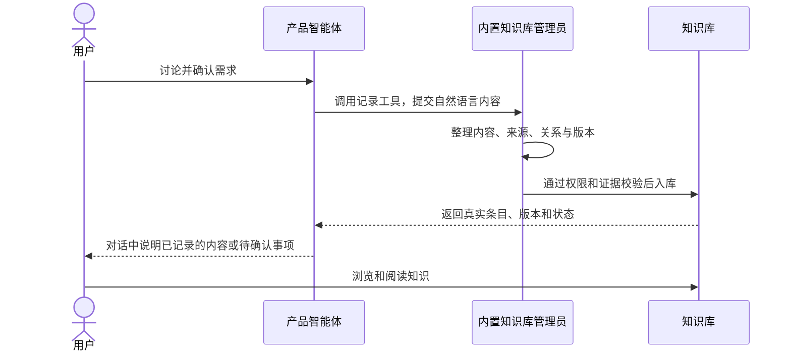

# 内置知识管理员与对话录入验收

状态：V2 实现与本机真实验收完成。

本轮依据用户 2026-09-08 的纠正：管理员是内置 Agent；沟通统一使用聊天；知识库标签页只看内容；产品等 Agent 调用管理员录入。上一版人工操作台的技术验收不能代替本轮产品验收。

## 目标流程

用户也可以直接与管理员聊天，使用同一 `/chat`、会话、运行时间线和 `AgentOutput` 正文。内部用于整理的 JSON 作业不混入用户聊天列表。

## 产品验收

| 场景 | 必须观察到的结果 | 状态 |
| --- | --- | --- |
| 系统内置身份 | 工作区自动提供唯一管理员；无需挑选普通 Agent | API/UI 已通过 |
| 统一聊天 | 管理员可直接聊天，正文与普通 Agent 共用组件 | 真实 GLM 对话成功 |
| 固定身份配置 | 模型和运行时可配置；名字、角色、职责不可随意修改 | UI 配置入口与 API 保护已通过 |
| 产品调用管理员 | 用户在产品对话中确认需求，产品真实调用记录工具 | 真实原生工具调用通过，0 次审批 |
| 自动录入闭合 | 管理员整理、通过原权限/证据/版本校验后返回入库回执；无人工发布操作 | effective v1 已在页面打开 |
| 知识库只读 | 浏览、搜索、正文、来源、关系、版本可用；没有录入、调查、整理或发布表单 | 页面与回归已通过 |
| 来源可追溯 | 知识记录保留真实调用 Agent/Run，不能由客户端冒充 | SQLite 来源与调用链一致 |
| 内部记录隔离 | 内部知识作业不出现在普通会话列表，不能当作聊天继续发送 | API 404 与回归已通过 |

## 实施边界

- 已确认需求与约定可以作为相应知识类型记录；这不代表实现或测试已经通过。
- 需要确认或存在冲突的内容在对话中反馈，不能靠模型口头成功取代数据库结果。
- 浏览搜索目前覆盖已加载内容；有后续分页时必须说明范围并保留继续加载入口。
- 保留已有知识与历史引用、白屏修复、发送失败恢复、工作目录重连和 Kimi 后台等待修复。
- 实现与验收使用 `codex/knowledge-experience` 独立 worktree；用户明确授权后再合入 main。

## 当前真实取证

- 隔离预览：`http://127.0.0.1:63313`，工作区 `ws_01M1TEPKAFT9QSM8R0ZZXZWCJY`；使用 SQLite 副本与独立运行目录，主树服务未修改。
- 内置管理员：`agent_knowledge_librarian_ws_01M1TEPKAFT9QSM8R0ZZXZWCJY`，唯一、`is_system=true`；修改名称返回 409，名称和版本保持不变。
- 管理员自然语言对话：`run_01M1Z93C0N4Y7NZZRCW0VNGH6W` 为 succeeded，统一聊天 UI 正常展示回复。
- 产品第一轮讨论：`run_01M1Z959BNPAJJ9ZWN7KSY9T2P` 为 succeeded；用户要求暂不保存，关联知识 Job 数为 0。
- 产品第二轮确认暴露 CLI 参数顺序和 Codex 本地网络沙箱问题；`run_01M1Z9EJ54VZ3F2X019BKR7D81` 已通过控制面停止，未创建知识 Job。CLI 参数和 help 已修复，原生工具重新验收已通过。
- 内部作业 `kbj_01M1YCZ3F3C27TXMCPKRJCD3MG` 的 WorkItem 及 Run 列表访问均返回 404。

## 模型连接修正

预览继承的 GLM 配置为 Responses 协议和 Chat Completions 地址，导致 `/api/coding/paas/v4/responses` 返回 404。依据 [智谱官方接入文档](https://docs.bigmodel.cn/cn/coding-plan/tool/others)，仅把预览 GLM Base URL 改为 `https://open.bigmodel.cn/api/v1`，保留 GLM 模型和 Codex 运行方式；随后真实对话成功。修改前配置备份在预览目录的 `before-glm-endpoint-fix.json`。

## 已完成检查

- 前端 111 个测试文件、903 项测试及 `tsc -b`、lint、生产 build 通过，包含最终知识工具文案、来源名字和终态审批卡修改。
- Go build/vet 通过；Knowledge/application/httpapi、SQL store、Kimi adapter、CLI/client、control-plane 的触面 race 检查通过。
- 迁移测试正确入口 `./cmd/migrate` race 通过；首次误用不含 Go 文件的 `./migrations` 目录产生 setup failure，已更正验证入口，没有修改或绕过测试。
- 受限原生工具的 Codex adapter、知识客户端、CLI race 测试通过。首次取消测试夹具未消费 HTTP 请求体而挂起，修正夹具后完整 adapter race 通过，取消断言保留。

## 自动录入与继续对话

产品 Run `run_01M1ZA6EHFC4SM46JT0M9JVM9K` 从普通用户消息自动发起 `atw_knowledge record`，产生管理员整理作业 `kbj_01M1ZA6YY6DZ6WFRWNBV20JA7N`；共 3 轮真实 GLM 整理后返回 `publication_status=published`，产品 Run 为 succeeded，审批事件为 0。

- 知识条目：`kb_01M1ZAB1434ME1ME08AMZAAD69`，标题“新成员欢迎页演示需求”，类型 requirement，effective v1。
- 版本：`kbv_01M1ZAB144XXDZ1RJ9JM08H5WE`。
- 来源：`kbs_01M1ZAB1442VSQNK1GQCYAK28J`；提交者为内置管理员，原来源为 Nova (`agent_01M1TEPKAFN21SC95JKKYASSPK`)，`origin_run_id` 精确指向产品 Run。
- 整理 coverage 为 partial，原因是尚无实现或测试证据；这不妨碍把用户明确确认的范围保存为需求，也不表示功能已实现。知识库页面实际可读到完整原文、来源 Nova 与 v1，关联数为 0，没有编造关系。

同一产品会话的后续 Run `run_01M1ZANFRVT4CVCY8BZ6V7BFJP` 确认使用了 resume，仍能调用原生知识工具并读取刚保存的版本；最终自然语言回答不再展示内部编号。该次 inquiry 的模型 finish 混入 curation 字段，虽已读到原始知识，其整理终结为 incomplete，不能称调查完整通过。随后已修正 inquiry 提示和有限协议 repair，并保持应用硬校验；非法输出不写知识，合法修复结果可正常终结，回归通过。

截图：

- `.agent-work/ui-evidence/v2-recorded-requirement.png`：只读详情、来源 Nova、v1。
- `.agent-work/ui-evidence/v2-product-knowledge-reply.png`：统一聊天中的自然语言核对结果。

## 工作区状态

实现与验收在 `/Users/yin/Documents/ybs/code/agent-work-knowledge-experience` 的 `codex/knowledge-experience` 分支完成。用户于 2026-09-08 授权合并到 main；具体提交以 Git 历史为准。原主树已有改动、原服务与数据库继续保留。任务工作树清理时，预览数据、运行目录和截图独立保留，避免删除验收成果。

## 最终管理员查询复验

使用最终构建从知识库“与知识管理员对话”进入普通 Chat，发送“请查一下团队刚保存的‘新成员欢迎页演示需求’，告诉我欢迎页应该显示什么，暂时不用修改知识”。

- 公开聊天 Run：`run_01M1ZB28NFA90J5Y5PS5WQD8SG`，succeeded。
- 内部查询 Job：`kbj_01M1ZB2FKMP24ZW0K8YDECNNYQ`，completed，2 轮，repair_attempt=0，last_error 为空。
- 查询真实读取 `kbv_01M1ZAB144XXDZ1RJ9JM08H5WE`，finish=complete，2 个引用。
- 管理员在统一聊天正文中回答“欢迎页应只显示欢迎语和‘开始使用’按钮”，并说明排除项和“尚未开始开发”；没有展示内部编号或命令。
- 新需求仍只有 1 条；该查询 Run 创建的 Submission 为 0，符合用户“暂时不用修改知识”。

全部本轮验收场景已收口。检查明细与原始日志保存在 workbench 的 `.agent-work/v2-*.log`，截图在 `.agent-work/ui-evidence/`。
