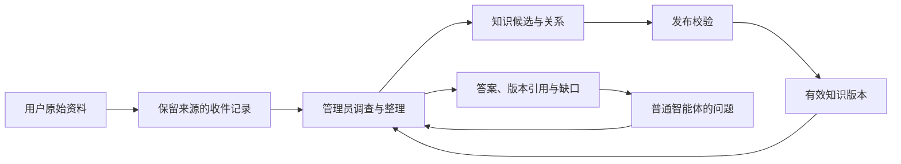

# 知识库与智能体交互：改造与验收记录

日期：2026-09-08。分支：`codex/knowledge-experience`。基线：`0edb78e`。

> 本文保留 2026-09-07 原始材料入口、Agent 整理和发布门的技术验收证据。其“交资料 / 提问题 / 看结果”页面方向已被 2026-09-08 产品决策废止，不代表当前知识库 Tab 的交互；当前知识库只读浏览，新增知识由其他 Agent 在聊天中主动调用内置知识管理员完成。

## 交付行为

用户日常只做三件事：交原始资料、提自然语言问题、看结果。管理员承担提炼标题、拆分知识、组织关系、记录来源和指出缺口。已发布知识显示在日常页面；模型、运行参数、范围筛选、候选发布与审计明细保留在管理入口。

| 用户原问题 | 处理结果 |
| --- | --- |
| 管理员配置找不到、选择后页面异常 | 修复 `skills:null` 的初始化和重置白屏；加入知识库管理员角色及自定义角色保留；知识库和设置可直达管理员唯一配置 |
| 智能体对话报错 | 识别迁移后的工作目录绑定失配，保留服务端校验并增加正式重连入口；发送失败保留原文与实体幂等键，常驻显示恢复路径 |
| 各智能体如何使用管理员 | 工作区选择一位管理员；本机 Agent 通过每轮获得的受限知识入口查询、按版本阅读和提交候选，答案包含来源与缺口 |
| 人类被要求整理数据结构 | 新增原始资料 API，用户不传 Agent 身份、类型、关系或证据 ID；管理员生成结构化候选及关系 |
| 小白页面交互 | 知识页以用户动作命名；成员选择显示名称；设置将工作目录与管理员提前，技术配置渐进展开 |

## 真实验收证据

验收使用独立 SQLite 备份、独立工作目录和运行配置。预览地址 `http://127.0.0.1:63313`，没有用该副本覆盖主工作树数据库。

| 场景 | 证据 | 判定 |
| --- | --- | --- |
| 管理员白屏复现 | 旧页面选择管理员后出现 `Cannot read properties of null (reading 'join')` | 已复现 |
| 管理员修复 | 新页面直达目标管理员，角色、模型及空描述正常显示；取消重置后页面保持可用 | 通过 |
| 目录失配 | 旧 Location 保存的 generation 与当前广告 generation 不同；创建 Run 被拒绝，未绕过边界 | 已定位 |
| 普通对话恢复 | `run_01M1Y90CW8EAE5KNMVQDV9K1R2` 成功，页面展示真实回复“对话连接正常” | 通过 |
| 用户交原文 | 只填写主题及原文，创建 `kbj_01M1Y9PW19BM9AKF0BF0Q6S9NM`，立即启动管理员 | 通过 |
| Agent 结构化 | 三轮真实 Codex Run 成功，生成三个知识候选和两个触发关系；来源为 user | 通过 |
| 保留不确定性 | 资料明确未提供上下游、约束和测试；Job 保持 incomplete，候选为 needs_review，没有宣称实际实现或测试通过 | 通过 |
| 普通 Agent 等待知识结果 | `run_01M1YCXQT8BK6F9T0SW241VW43` 成功，耗时约 3 分 51 秒；管理员结果带 5 条引用，并固定读取三个有效 v1；终态临时凭据已清理 | 通过 |

原始材料对应候选提交为 `kss_01M1Y9SADQ72FWDR3CY1S7P39C`，生成：

1. 隔离演示：通知提交入队。
2. 隔离演示：通知发送失败自动重试。
3. 隔离演示：通知最终失败标记与操作者提醒。

这些内容最初是保留缺口和用户来源的可复核草稿。随后通过真实 UI 发布，三个条目均为 v1，日常列表由 2 条增加到 5 条。发布仅发生在隔离验收副本，资料仍明确标注演示性质和未验证的实现/测试信息。

## 数据如何流动

| 数据对象 | 作用 | 谁整理 |
| --- | --- | --- |
| Source | 原文、摘录、提交来源及核验状态 | 系统保存原文；Agent 核实 |
| Submission | 收件和结构化候选包 | 系统接收；Agent 提炼 |
| KnowledgeJob | 调查进度、预算、结果及缺口 | 管理员执行，控制面推进 |
| Item / Version | 稳定知识身份和可引用版本 | Agent 提出；控制面落库与校验 |
| Relation | 依赖、触发、约束等关系及证据 | Agent 从资料提取 |
| Snapshot / Index | 固定查询引用与可重建检索视图 | 系统维护 |

## 自动化验证

- 前端构建（包含 `tsc -b`）及 ESLint 通过。
- 全部前端测试：110 个文件、900 条断言通过。
- `go build ./...`、`go vet ./...` 通过。
- application/httpapi 的知识相关 `go test -race -count=1` 通过。
- Kimi app-server 适配器的完整包 `go test -race -count=1` 通过，覆盖后台通知、批量重放和精确取消。
- `cmd/atw-knowledge` 的 race 测试通过；默认等待预算覆盖服务端 Job 默认预算。
- 改动 Go 文件的 gofmt 检查干净。
- 浏览器检查了管理员深链与重置、发送失败原文保留、正常对话、资料提交及整理结果。

## 边界

- 原始资料入口目前支持粘贴文本；文件上传没有被包装成已支持能力。
- 当前服务身份为本地 M1 `user_demo`，不是生产登录系统。
- 普通 Agent 知识工具目前由本机配置的知识 CLI bridge 提供；远程主机没有被假定可使用本机临时凭据文件。
- 未发送队列仍是内存状态；刷新或切换工作区不承诺恢复。
- 未合入 main，未推送；按仓库约定等待用户明确合并指令。

## 运行验收文件

结构化验收记录保存在本次 worktree 的 `agent-team-workbench/.agent-work/acceptance.json`；浏览器截图位于同目录的 `ui-evidence/`。预览可通过 `.agent-work/preview/start-preview.py` 恢复；该脚本只操作记录中的隔离预览进程，拒绝 PID 归属不匹配。
