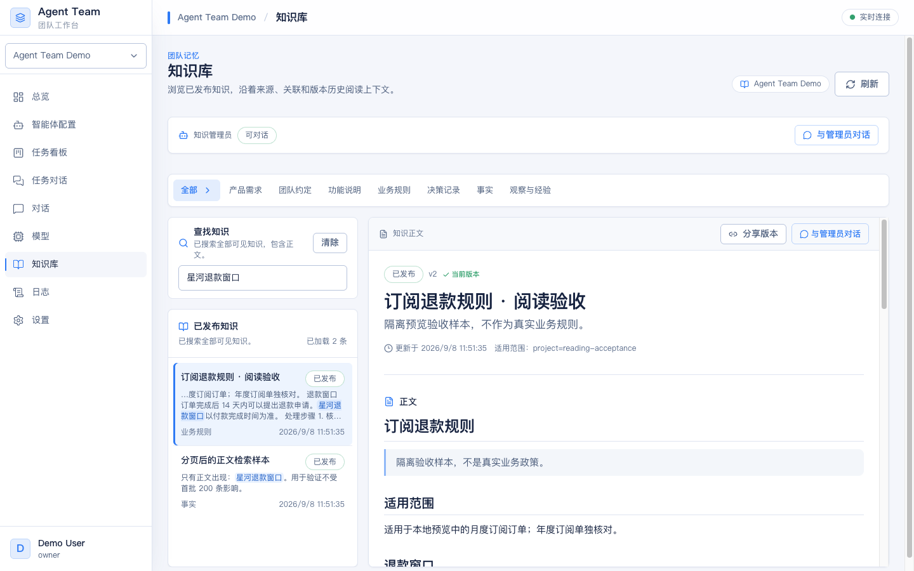
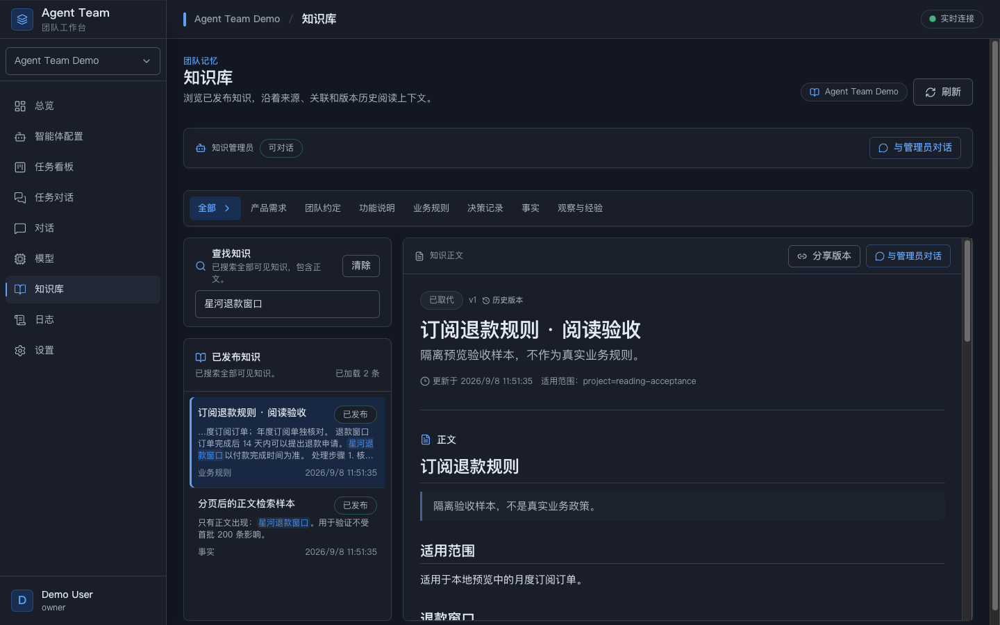
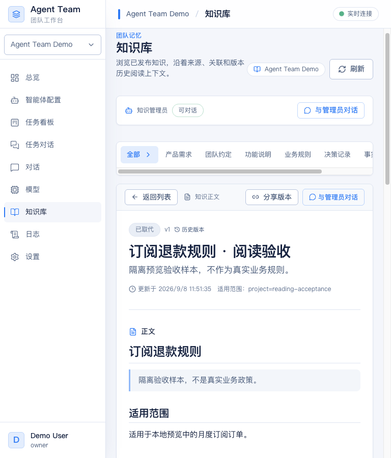

# 知识阅读与统一主题验收

状态：实现和本机隔离验收完成，停留 `codex/knowledge-reading`，尚未合并 main。

日期：2026-09-08。基线：main `739a374`。实现目录：`/Users/yin/Documents/ybs/code/agent-work-knowledge-reading`。

## 交付行为

- 全工作台采用生产 Agent 正文的 LanguageGUI 明暗主题、无衬线字体与语义组件；移除宣纸、山水、书法、印章式装饰和水墨栏目文案。
- 主侧栏固定显示图标与文字，删除折叠状态、悬浮展开和移动汉堡入口。宽屏 240px、较窄窗口 208/160px，独立滚动。
- 知识页采用紧凑列表与宽正文；1440px 下正文实测 756px，768px 下保留固定菜单与 455px 正文，提供返回列表。
- 全库搜索复用 SQLite/FTS5 与中文子串 fallback，保留 workspace、visibility、kind、scope、status 过滤；结果含命中摘要和安全高亮，cursor 不跳项。
- 条目、查询、类型、工作区和版本进入 URL。关系目标可读可点，来源提供支持的任务、Run 和 HTTP(S) 文档链接。版本历史、真实行差异和正文目录可用。
- 知识条目进入统一管理员 Chat 后，读取授权版本并生成可编辑问题草稿；不自动发送。恢复历史时等待会话身份和 Run 历史确认；不可访问或加载失败时显示重试，并保持输入不可用。

## 验证结果

| 验证面 | 命令或实际行为 | 结果 |
| --- | --- | --- |
| 前端类型 | `pnpm exec tsc -b` | 通过 |
| 前端测试 | `pnpm test` | 113 文件，918 测试通过 |
| 前端 lint/build | `pnpm lint`、`pnpm build` | 通过；保留原有大 chunk 提示，未调整阈值 |
| Go 构建与静态检查 | `go build ./...`、`go vet ./...` | 通过 |
| Go 触面测试 | `go test ./internal/persistence/sqlstore ./internal/httpapi` | 最终后端修改后通过 |
| Go 最终搜索 race | `go test -race -count=1 ./internal/persistence/sqlstore -run 'TestKnowledgeSearchItemsPage'`；`go test -race -count=1 ./internal/httpapi -run 'TestKnowledgeHTTPItemsSearchUsesBodyProjectionAndStableCursor'` | 通过，约 12.3s / 5.6s |
| Go 包级 race | `go test -race -count=1 ./internal/persistence/sqlstore ./internal/httpapi` | 末次控制字符/摘要加固之前通过；末次修改后用上行搜索用例复核，未将旧结果当作最终全包重跑 |
| 原知识回放 | 在数据库副本中读取真实生成的“新成员欢迎页演示需求”和原管理员回复 | 知识正文、AgentOutput 与历史 Chat 可见 |
| 搜索分页 | 首批 200 条不含目标；搜索“星河退款窗口”返回目标；limit=1 连续两页完整 | 通过，包含正文专有词、kind/scope 与废止排除 |
| 版本与目录 | v2 为 14 天；切到 v1 显示 7 天，差异显示新增 14 天；目录定位“退款窗口” | 通过，URL 保留 q/ws/version |
| 关联 | 点“分页后的正文检索样本”进入目标，显示反向关联与标题 | 通过 |
| Chat 往返 | 从 v1 进入管理员草稿，再返回知识 | 保留查询、工作区和 v1；未自动发送 |
| 历史 Chat 错误 | `knowledge+c=wi_missing` | 显示可重试错误且没有输入框；有效 c 恢复原回复和空草稿 |
| 全局主题 | 总览、智能体、模型、任务、设置与知识/Chat 明暗切换；设置 Drawer portal | 主侧栏、页面、正文与弹层同源；弹层焦点在 dialog 内 |
| 固定导航与布局 | 1440/768 真实截图，主导航 9 个文本入口均存在 | 无页面级横向溢出，无收起/悬浮展开行为 |
| 变更卫生 | `git diff --check`、新增行秘密模式扫描 | 通过，未命中凭据模式 |

过程中曾发现并修复搜索框折行、1440 正文被多列压窄、丢工作区参数、图片演示断言失败、历史会话未就绪即可输入等问题；没有删除必要断言来绕过失败。

## 真实数据与样本边界

预览地址：`http://127.0.0.1:57111`，使用本分支生产前端构建与控制面二进制。

数据库通过 SQLite backup 从先前对话录入验收目录复制；原服务与原数据库不修改。副本初始有 7 条知识、86 个终态 Run、18 个知识 Job。在副本中通过当前仓储发布接口加入 207 条明确标为“隔离验收样本”的知识，用于分页、长文、来源和版本验证；它们不代表真实业务政策。

最终副本有 214 条知识、86 个 Run、18 个知识 Job、0 个活动 Run，说明本轮浏览、搜索和准备草稿没有额外启动模型或知识整理。没有把历史真实模型调用当成本轮新增模型录入验收；本轮没有改模型接入和知识管理员执行协议。

原始日志、JSON 证据、样本生成器与预览 PID 位于 workbench 的 `.agent-work/preview/`。该目录为隔离验收环境，不提交数据库或凭据。

## 界面证据

## 保留边界

SQLite 仍是知识权威；索引只是已发布读取投影。知识页面维持只读，写入与问答继续使用内置知识管理员的统一 Chat。未引入外部 Wiki/RAG 平台、向量库或图数据库。真实用户认证体系、外部来源连接器和远程知识工具传输仍是原有边界，本轮不宣称补齐。
