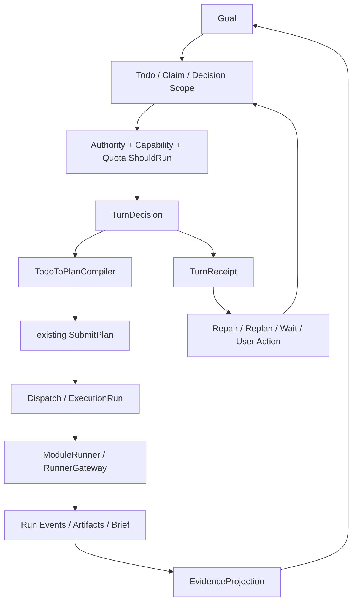

# LoopX 长程治理语义原生移植：目标与需求合同

- 状态：WP0–WP7 repository implementation complete；本机 Go/Web/浏览器门禁已通过；真实 Codex/Kimi Provider 与 Remote Host/Runner gate pending
- 确认日期：2026-09-03
- 事实源：[系统架构事实源](../architecture/system-architecture-handbook.md)
- 路线依据：[LoopX 任务底座架构评估](../architecture/2026-09-01-loopx-task-foundation-architecture-assessment.md)

本目标的治理迁移范围是 `0024`–`0035` 与 `0039`–`0042`。`0036`–`0038` 与本目标同分支交付，但属于独立的 Agent config / idempotency 加固，不改变本治理范围的边界。

## 1. 决策摘要

Agent Team Workbench 将原生实现 LoopX 式长程治理语义，但不运行 LoopX，不复制其 Python/TypeScript 文件态实现，也不替换现有任务执行底座。

保留的执行权威：

```text
WorkItem → Plan → Dispatch → ExecutionRun → TaskSession → RunnerGateway
```

新增的治理权威：

```text
Goal → Todo / Claim / DecisionScope → Quota / ShouldRun
     → TurnDecision / TurnReceipt → TodoToPlanCompiler
     → 现有 SubmitPlan
     → Evidence / Handoff / ProjectionRepair
```

核心原则：**迁语义，不迁实现；新增意图层，不复制执行层；所有状态继续进入 Go + SQLite + Outbox 的单一权威链。**

## 2. 要解决的问题

### 2.1 Planner 到控制面的边界不可靠

本 Goal 确认时的基线是：Task Coordinator 通过最终 Markdown 中的 ` ```plan ` JSON 数组表达控制决策。围栏名、JSON 语法、字段、动词或等待屏障错误都会在 Run 成功后才被发现，当时没有持久化 bounded repair；不少错误最终要求用户 unblock。R0 的当前实施状态见下文，不以这段历史问题陈述冒充现状。

### 2.2 根 Task 控制线不足以表达长期 Goal

Coordinator state 能推进一个根 Task，但没有独立表达：

- 跨多个 bounded turn 的长期目标与阶段。
- Todo 的 claim、decision scope、resume condition 与 handoff。
- Turn admission、quota spend 和 receipt-bound settlement。
- Evidence 完整度、投影 gap 与可重放 repair。

### 2.3 状态存在，但治理语义分散

ATW 已有 Run、Plan、Dispatch、Lease、Approval、Artifact、Brief、Usage 和恢复能力；缺少一个统一上层协议来决定“本轮是否允许执行、执行哪一个 bounded action、凭什么完成、失败后 repair/replan/user action 哪一种”。

## 3. 产品目标

### G1. 一个可恢复的长期 Goal

用户创建或系统升级一个长期 Goal 后，系统能把它拆成可认领、可验证、可暂停和可恢复的 Todo；进程重启或 Agent/Runtime 更换不丢失下一动作。

根控制线发生 blocker 时，WorkItem、Coordinator、Goal、当前 Todo 必须原子进入 blocked，Todo claim 同步释放；显式 unblock 后恢复 Goal/Todo 进入新的 bounded cycle，不复活旧 claim，不重新伪造本轮 receipt。

### G2. 不再让自由文本直接驱动控制面

控制决策必须经版本化 DTO/schema、严格 decoder、authority/quota/capability 校验后才能进入现有事务执行器。

### G3. 证据而不是 Agent 自报决定进度

Todo/Goal 进度必须引用 WorkItem、Plan、Run、Artifact、DeliveryBrief、validation 的权威 ID；模型文本只能是说明，不能单独证明完成。

### G4. 单一任务执行真相源

Goal/Todo 管意图；WorkItem/Plan/Run 管执行。不得新增第二套 Run、Runner Lease、Scheduler、Settlement、Usage ledger 或事件库。

受管系统 Coordinator 缺少 Goal 或当前 Todo 时必须 fail closed；不允许通过普通或 legacy `SubmitPlan` 绕过治理链创建 Plan/Run。

### G5. 分阶段可交付

每一阶段都必须独立可用、可验证、可回滚；不以一次“大迁移”作为获得首个收益的前提。

## 4. 非目标

首轮明确不做：

- 不引入 `.loopx` registry、Markdown Todo 权威文件或跨 runtime 文件锁。
- 不把 LoopX 作为外部生产控制面。
- 不替换 WorkItem、Plan、Dispatch、ExecutionRun、TaskSession 或 RunnerGateway。
- 不建设通用任意 DAG、跨 Goal 依赖图或跨租户 Goal 市场。
- 不建设计费、套餐、发票或多租户账单系统。
- 不建设完整 Goal 可视化编辑器；首阶段 UI 只提供可观测面。
- 不把 `stream-json` 传输格式声明为模型 schema-constrained output。
- 不保留永久 fenced-plan 兼容双轨。
- 不借此 Goal 顺手修复架构事实源中列出的所有既有风险；它们另开任务。

## 5. 术语与权威边界

| 术语 | 定义 | 权威 |
|---|---|---|
| Goal | 跨多个 bounded turn 的长期目标和验收合同 | 新 Goal aggregate |
| Todo | Goal 下一组可执行/等待/人工门控动作 | 新 Todo aggregate |
| Claim | 某 Agent 对 Todo 的治理层所有权，不是 Runner lease | Todo/Claim 表 |
| DecisionScope | Todo 允许读取/写入/派发的边界 | Todo snapshot |
| TurnDecision | `execute / repair / replan / wait / user_action / finish` 的控制决定 | 新 TurnDecision |
| TurnReceipt | Turn 输入、决定、写回、spend、证据和幂等身份的不可变 canonical record | 新 TurnReceipt |
| Quota | Turn/Worker/token/cost 的准入与花费 | Goal Quota ledger |
| PlanDecision | 可被严格校验并编译为现有 Plan 的版本化结构 | DTO/schema + decoder |
| Handoff | Todo 所有权/上下文转移合同 | 新 Handoff record |
| Evidence | 对既有权威执行实体的引用和验证结果 | Evidence projection |
| ProjectionRepair | 从 canonical receipt/event 重建治理投影，不创造或改写 receipt/执行终态 | Repair record + derived projection |

权威分工：

- Goal/Todo 回答“为什么做、下一步做什么、是否允许继续”。
- WorkItem/Plan/Run 回答“实际执行什么、执行到哪里、结果是什么”。
- TaskSession/Runner Lease 回答“在哪个 Provider/进程/Host 继续执行”。
- Event/Receipt 回答“某次状态变化为何发生、是否已提交和是否可重放”。

## 6. 目标架构



### 6.1 单一写链

```text
typed decision
  → Go strict decoder
  → authority / quota / capability checks
  → SQLite transaction
  → domain state + event + receipt + outbox
  → existing dispatch / settlement
  → server read model / UI
```

Todo 不得直接调用 Dispatcher 或创建 ExecutionRun；唯一允许的执行入口是 `TodoToPlanCompiler → SubmitPlan`。

## 7. 功能需求

### R0. PlanDecisionV2 与 bounded repair

实施状态（2026-09-03）：canonical schema、强类型 decoder、五类错误、Run control snapshot、两次持久 `repair_plan`、重启/并发重放、用户 unblock 新预算以及 source Run/runtime/context 约束已落。系统 Coordinator 只接受 raw `PlanDecisionV2` JSON，不再从 ` ```plan ` 或宽松 JSON 中提取控制指令；缺 Goal/当前 Todo 直接 fail closed，不转 ordinary/legacy `SubmitPlan`。Codex/Kimi 当前均如实声明 `schema_constrained_output=unavailable`，因此走同一 text decoder；退出门仍欠真实 Codex/Kimi 各一条合法 decision 与一条 repair，不将 mock/race 结果冒充真实 Provider 证据。

系统必须定义版本化 `PlanDecisionV2`，能表达现有五个 Plan 动词及其严格字段，并区分：

- `plan_json_syntax`
- `plan_schema_validation`
- `plan_semantic_validation`
- `plan_authority_denied`
- `plan_quota_denied`

唯一 wire envelope：

```json
{
  "schema_version": "plan-decision/v2",
  "kind": "plan",
  "reason": "本轮决策理由",
  "next_action": "提交后系统应观察的下一动作",
  "steps": []
}
```

Envelope 的 required 字段固定为 `schema_version`、`kind`、`reason`、`next_action`、`steps`；前两者分别是常量字符串 `plan-decision/v2` 和 `plan`，后两者是 1–2000、1–1000 字符的 UTF-8 string。Envelope 与每种 step 都必须 `additionalProperties=false`；未知字段、未知 verb、错误类型和超界值一律拒绝，不静默丢弃。`steps` 为 1–64 项并使用 `verb` discriminator 的闭合 `oneOf`。`reason`/`next_action` 是审计说明，不参与执行权限判定。

五种 step 的闭合字段合同：

| verb | 必填字段 | 可选字段 | 主要界限 |
|---|---|---|---|
| `dispatch` | `agent_id:string`、`title:string`、`instruction:string`、`acceptance:string[]` | `priority:string`、`knowledge_from:integer` | agent_id 过 domain ID validator；title 1–200；instruction 1–20000；acceptance 1–32 项且每项 1–1000；priority 仅 `low/medium/high/urgent`；knowledge_from 为 0–63 且小于本 step index |
| `consult_knowledge` | `corpus:string`、`terms:string[]` | `limit:integer` | corpus 单层安全名；terms 1–32 项且每项 1–500；limit 1–50 |
| `defer` | 无 | `wake_at:string` | wake_at 必须 RFC3339；无 wake_at 时，等待集内必须存在 active child |
| `join` | `children:string|string[]` | `wake_at:string` | children 为 `"all"` 或 1–128 个通过 domain validator 的本 Task child ID，禁止重复；wake_at 为 RFC3339 |
| `finish` | 无 | `evaluation:boolean` | dispatch 后必须先经过 join/defer |

执行 DTO 必须由 schema-generated/手写强类型 Go struct 解码，不能继续以 `map[string]any` 作为协议真相；解码成功后仍复用 `SubmitPlan` 的 workspace/owner/source/barrier/guardrail/authority 校验。

Provider 支持原生 schema 时优先启用；不支持时仍走同一 decoder。第一次和第二次可修复错误必须回送同一 Coordinator session，生成持久 `repair_plan` turn；达到预算后才 blocker。

**为何**：先解决当前最直接、频率最高的 Planner 边界故障，同时建立后续 typed command 的公共 decoder。

### R1. Goal aggregate

Goal 必须包含：目标文本、验收合同、状态、阶段、根 WorkItem 引用、当前 Todo、版本、预算、创建/更新时间和完成证据摘要。

建议状态：`draft / active / waiting / blocked / completed / cancelled`。

- `completed` 只能由验收合同和证据门禁推进。
- Goal 不直接拥有 Run ID 列表；通过 WorkItem/Evidence 读取。
- 一个 Goal 首版绑定一个根 WorkItem；跨根 Goal 后置。

**为何**：从根 Task 中抽离长期意图，但不复制执行状态机。

### R2. Todo / Claim / DecisionScope

Todo 必须支持：

- class：`advancement / monitor / user_gate / blocker / validation`
- status：`pending / claimed / running / waiting / completed / blocked / cancelled`
- bounded instruction、验收条件、resume condition、优先级、前驱/后继引用。
- claim owner、claim version、claim/expiry 时间；claim 不等于 Runner lease。
- decision scope：允许的 WorkItem、Agent、Runtime capability、写作用域和最大派发范围。
- `decision_scope.agent_ids` 同时约束 claim owner 与本 Turn 可被 `dispatch` 的目标 Agent；初始 Todo 在创建时固化系统 Coordinator 与当时已启用 Worker roster，后续 roster 变化不静默扩大既有 Todo 权限。
- `decision_scope.work_item_ids` 中的 root Task 只额外授予对其 direct child 的 `join` 观察权，用于引用既有 Plan child；不自动授权任意深层 descendant、跨 root WorkItem 或直接创建 Run。

Todo 完成必须具备 completion identity，重复完成同一个 turn 不得重复写证据或 spend。

Completion identity 由 `completion_turn_key=(goal_id,todo_id,turn_seq)` 与
`completion_evidence_id` 组成；`turn_seq` 必须是当前 Todo 的最新已 admission
Turn，且对应的不可变 `TurnReceipt Header` 必须真实存在。完成后的 Todo 是终态审计
记录，不能再改写业务字段、claim 或 completion identity。

**为何**：让每个 Turn 有清晰、可认领、可验证的边界，降低长期会话中的目标漂移。

### R3. TurnDecision / TurnReceipt

实施状态（2026-09-03）：`TodoToPlanCompiler`、DecisionScope claim/dispatch allowlist、claim+admission 原子边界、Plan TurnKey/client key/digest、receipt phase 1–7、Run governance input、并发/restart gap replay 与多 Turn settlement 已接入现有 Coordinator。六类 `TurnDecision`（`execute`、`repair`、`replan`、`wait`、`user_action`、`finish`）均使用 phase 1–7 control receipt；AdmissionKey replay 会重新校验输入 digest，缺失 phase/reservation 可从 canonical Header/Phase 补齐，phase 7 由调用方在 Coordinator 状态 CAS 后追加。Quota 的 turn/worker/token/cost 准入、canonical usage、per-kind cumulative anchor、per-Run price digest 与 phase6 结算已落；Plan/Run 永久拒绝会在 phase3 记录 rejection 并同事务关闭 reservation，存储故障则保留 durable retry checkpoint。Projection/Evidence phase7、Handoff、Delivery Brief snapshot 和人工 Accept 同事务完成链已落。根 blocker 的 WorkItem/Coordinator/Goal/current Todo 四层同步与 claim 释放同事务完成；unblock 恢复 Goal/Todo 且开启新 repair budget。

waiting Plan 被新 Plan supersede 时，旧 Plan 的 pending manual dispatch approval 同事务进入 `expired` 并发布 `approval.expired`；迟到审批只得到终态冲突，不再产生 child Run。

当前 enforce 入口只接受受保护的 system Task Coordinator control line；没有 Coordinator state 的 standalone Goal/Todo 编译 fail closed，待未来明确其 source Run、ContextSnapshot 继承与验收所有权后另行开放。

TurnDecision 闭集：

- `execute`
- `repair`
- `replan`
- `wait`
- `user_action`
- `finish`

TurnReceipt 必须记录：Goal/Todo/attempt/schema 版本、输入 snapshot digest、decision、Plan/Run 引用、validation、quota reservation/spend、evidence、settlement 状态和幂等 key。

Receipt 边界必须明确：

- canonical TurnReceipt 是一个 append-only receipt stream，身份固定为 `turn_key=(goal_id, todo_id, turn_seq)`，不得使用另一个 `turn_id` 命名同一概念。
- `turn_seq` 在 admission 时通过 Todo version CAS 分配，按 Todo 从 1 单调递增；同一 admission client key 重放必须返回同一个 turn_key。
- admission 创建不可变 `TurnReceiptHeader`（turn_key、schema version、input snapshot digest、created_at）。后续阶段写不可变 `TurnReceiptPhase`，唯一键为 `(goal_id, todo_id, turn_seq, phase_seq)`；phase_seq 按合同顺序固定。
- Header 与每个 Phase payload 都用 RFC8785 canonical JSON 编码并计算 SHA-256 digest；同 identity、同 digest 重放幂等，同 identity、不同 digest 冲突。
- 同 identity、同 digest 重放返回原 receipt；同 identity、不同 digest 是幂等冲突。
- settlement 的阶段状态只能追加 Phase record，不原地改写 Header 或已发布 Phase。
- `GoalProgress`、`TodoCurrentState`、timeline、evidence summary 是可重建 projection，不是 Receipt 本体。
- ProjectionRepair 只能 replay canonical Receipt/Event；不得合成一个历史上不存在的 canonical Receipt。

建议 settlement 相位：

```text
admission
→ decision_decode
→ validation
→ durable_writeback
→ plan_compile/dispatch
→ quota_spend
→ projection/outbox
```

所有相位不要求一个长 SQL 事务覆盖外部执行；必须用持久 receipt/outbox 表达已提交边界与重放语义。

**为何**：把“模型说了什么”和“系统真正提交了什么”分开，使崩溃恢复可证明。

### R4. Quota / ShouldRun

首版 Quota 单位闭集：

- `turn_count`：成功进入 admission 的治理 Turn 数。
- `active_worker`：瞬时并发 gauge，不作为累计 spend。
- `input_tokens_total`：Provider 报告的本 Run 总输入，可能包含 cache read/write，用于 token 总额准入。
- `input_uncached_tokens`、`cache_read_tokens`、`cache_write_tokens`、`output_tokens`：明确的 billable buckets，用于价格计算。
- `cost_microusd`：美元的百万分之一，整数存储，禁止浮点累计。

ShouldRun 必须在创建 Coordinator/Worker Run 前执行。超额时不创建 Run，返回可解释的 `quota_denied` 或 `user_action`。

价格来源必须是 Model Registry 中版本化的价格快照：`currency=USD`、uncached input/cache read/cache write/output 每百万 token 的 `microusd` 单价、effective_at、price_version/digest。Reservation/Run input 固化使用的 price digest；不得在结算时重读“当前价格”。没有价格的模型仍可执行 token quota，但启用 cost quota 的 Goal 必须 fail-closed 为 `cost_price_unavailable`。

Usage 口径：

- Quota 只接受 `usage_basis=per_run` 的 delta。现有 `InputTokens/CachedTokens` 口径不得直接用于 cost：部分 Adapter 的 InputTokens 已包含 cached 子集。
- 引入版本化 canonical usage buckets；Adapter 必须明确映射 uncached/cache read/cache write/output。若 Provider 只给 total input 与 cached total，只有当价格快照声明 read/write 同价时才可合并；否则 cost usage 为 `usage_unresolved`。
- Provider 返回 session cumulative 时，Adapter/Session 层必须先以持久 anchor 水位换算成 per-run buckets；无法证明 delta 时写 `usage_unresolved`，只阻止启用了受影响 token/cost quota 的 Goal 继续创建新 Run，不影响未启用该 quota kind 的 Goal。
- `cost_microusd = uncached_input*input_price + cache_read*cache_read_price + cache_write*cache_write_price + output*output_price`，按每百万 token 的整数单价做 checked integer arithmetic 和 half-up 舍入。
- `canonical_usage(+digest)` 只能存在于终态 Run；Go repository guard 与 0035 SQLite terminal-only trigger 双重拒绝非终态写入，升级遇到既有违规时迁移本身失败，不静默放过。

Reservation 生命周期：`reserved / committed / released / expired`。唯一键固定为 `(goal_id, todo_id, turn_seq, quota_kind)`，与 Receipt turn_key 同源；同 key 重放幂等。

- 每种 quota 的 reservation/gauge 必须绑定可重放权威身份：`turn_count` 与 Header admission 同事务（成功 admission 即计一次，后续 Plan 失败不倒扣）；`active_worker` 不建 reservation，在 Worker Run insert 前用同事务 gauge；token/cost 是一个 Turn 内多 Run 共享的 aggregate reservation，与 Header 同事务冻结并以 source Run + plan client key + decision digest 作 durable checkpoint。永久 Plan/Run 拒绝必须同事务结算 source usage、关闭 reservation 并 block Todo；存储故障保留 checkpoint 重放，不当作业务拒绝。
- Run 终态后以实际 per-run usage 幂等 commit，未用额度 release；commit 与 receipt/event/outbox 同一事务或由可重放 outbox consumer 完成。
- cancelled/failed Run 仍按实际 usage commit，不能按结果成败免除消耗。
- Reconcile 只可释放“证明没有 Run”或已终态且未 commit 的 reservation；不能按 wall clock 盲目过期 active Run 额度。
- 已落账的 unresolved spend 只能通过 append-only `QuotaGapResolution` 对账：必须绑定 passed/accepted 权威 Evidence，v1 只允许 `reconciled`、不允许 waiver；原 spend/canonical/reservation 永不改写，对账 amount 追加进 committed 并继续参与 ShouldRun。
- active_worker 通过 active Run/有效 reservation 计算，lease 过期或终态后释放。
- 根 blocker 会 sweep 该 root WorkItem 的所有 open Dispatch，以 CAS 关闭为 `degraded`；并发或迟到的 Worker 终态不得复活已关闭批次。

**为何**：PlanGuardrails 只能约束单 Plan；长期 Goal 需要跨 Turn 预算和可重放 spend。

### R5. Handoff

实施状态（2026-09-03）：Handoff aggregate、source/target/runtime 显式映射、原子 claim transfer、accept/reject/cancel/replay 和 REST 已落；不带 Provider session history。accepted Handoff 已接入 durable continuation、same-generation claim renewal、late-source Plan fence、settlement wake reroute 与 blocker 后 checkpoint clear；阻塞会释放 claim、保留 transferred Handoff 历史，并让 Unblock 明确回到 system Coordinator，不静默复活 stale target。

Handoff 必须记录 source/target Agent 或 Runtime、Todo、原因、上下文摘要、证据列表、未决风险、claim transfer 与接受状态。

- Handoff 不复制 Provider session history。
- target 必须基于 TaskSession/ContextSnapshot 重新决定 resume/fresh；source snapshot 只能来自 state 当前受保护 Coordinator Run，不从同 Agent 历史 Run 猜测。
- 只有 target 接受并获得 claim 后，source 才释放治理所有权。
- 已 transferred target 可再次发起 Handoff；新 checkpoint 必须精确绑定上一跳 Handoff/claim generation 和当前 source Run。
- accept 之后 source 的迟到 PlanDecision/evaluation verdict 只作 Run evidence，不再推进 Plan 或验收。

**为何**：现有 session handoff summary 解决上下文压缩，不等于任务所有权交接。

### R6. Evidence 与 ProjectionRepair

实施状态（2026-09-02）：ValidationResult、accepted Artifact、Approval、Run/Plan/WorkItem 与 immutable Delivery Brief snapshot 已进入 scope/freshness/status gate；ProjectionRepair 只重放 canonical Receipt/Event，projection digest 防篡改，人工 Accept 仍是唯一最终完成门。

Evidence 必须引用既有实体 ID：WorkItem、Plan、Run、Artifact、Approval、DeliveryBrief、validation result。模型自报文本不能单独作为完成证据。

ProjectionRepair 只能：

- 重算 Goal/Todo progress。
- 从 canonical Receipt/Event 重建 Evidence、Receipt timeline 和其他读模型投影。
- 恢复丢失的下一动作 checkpoint。

不得：

- 覆盖终态 Run/Plan。
- 创造、删除或改写 canonical TurnReceipt。
- 伪造 Artifact accepted 或 validation pass。
- 绕过人工 Accept。

**为何**：借鉴 LoopX repair/projection 思路，同时保留 ATW 领域终态的不可逆性。

### R7. API、Event、MCP 与 UI

实施状态（2026-09-03）：workspace-scoped REST、RBAC/idempotency、live AsyncAPI/SSE invalidation、Service-backed MCP 和 Task GovernancePanel 已落。Restricted Delivery Brief snapshot 不暴露给无 RBAC 的 MCP；quota reconciliation 仅有 Approval-only REST 写入。Goal/Todo/Quota/Receipt/Handoff/Evidence/Projection repair 等集合字段在 REST/MCP 中统一编码为 `[]` 而非 `null`。

真实浏览器验收已覆盖 1440 与 1024 宽度：GovernancePanel 的 Coordinator/Goal/Todo blocker 状态一致，治理链读模型一致，未发现横向溢出；截图证据保存在评审文档的 [`assets/`](../review/assets/) 目录。

首阶段必须提供：

- Goal/Todo/Receipt/Quota 查询 API。
- Goal start/pause/resume/cancel、Todo claim/release、user action resolve 命令。
- Canonical events 与 AsyncAPI 白名单。
- Task 页面最小可观测面：Goal 状态、当前 Todo、Quota、TurnDecision、下一动作、阻塞和 receipt/evidence 链接。

首阶段不提供完整 Goal 图编辑器。所有 UI 数据来自服务端 read model；SSE 只做通知/失效重拉。

MCP 首版只增加查询和受限 claim/user-action 命令；不得绕过 HTTP/Service 权威链或直接改表。

### R8. 旧协议迁移与删除

实施状态（2026-09-03）：生产 Coordinator 只接受 raw PlanDecisionV2；` ```plan ` 主提取、`control_decision_mode`、governance shadow-only 命名和无消费者事件已删。裸 JSON 数组会被 canonical decoder 明确判为 schema 错误，Markdown fence/普通说明不会启用兼容解析；格式问题统一进入有界 repair，永不绕过 `PlanDecisionV2` decoder。

- 不保留永久双轨、注释掉的旧代码或第二套 schema。

## 8. 关键不变式

1. ATW 是 Goal、Task、Run、Scheduler、Lease、Quota、Usage 的唯一数据库真相源。
2. Goal/Todo 不直接创建或推进 Run。
3. Run 状态仍只有 `transitionRunLocked`/远程事件原子入口可推进。
4. Runtime Adapter 只返回 Outcome/Events，不拥有业务 retry/Goal 决策。
5. Quota spend 按 Turn/Run 幂等，重放不能重复计费。
6. Claim 是治理所有权；Runner lease 是执行权，两者不可合并成一张无语义表。
7. Receipt 先证明 durable writeback，再允许 projection 表示已完成。
8. Evidence 只能引用权威实体或验证结果。
9. Projection repair 不修改领域终态。
10. 用户 Accept 仍是 Task/Goal 最终完成的人工门。
11. Goal/Todo/Receipt 状态变化必须与 event/outbox 同事务。
12. 任何 provider 不支持的 structured/tool 能力必须显式降级或拒绝，不按名称猜测。
13. 根 blocker 原子同步 WorkItem、Coordinator、Goal、current Todo 并释放 claim；unblock 不复用旧 claim 或伪造旧 Turn。
14. 缺 Goal/当前 Todo 的受管系统 Coordinator fail closed，不调用普通/legacy `SubmitPlan`。
15. 根 blocker 关闭该 root 的全部 open Dispatch；迟到或并发终态不得复活批次。
16. `canonical_usage(+digest)` 只允许终态 Run 持有；0035 SQLite trigger 与 Go repository guard 必须同时成立。

## 9. 失败语义

| 失败 | 自动处理 | 最终边界 |
|---|---|---|
| JSON 语法错误 | `repair_plan`，最多 2 次 | `plan_json_syntax` blocker |
| Schema 错误 | 返回字段级 validation，再 repair | `plan_schema_validation` blocker |
| 语义/authority 错误 | repair 或 replan，按错误族判断 | 不可修复则 user_action/blocked |
| Quota 不足 | 不创建 Run；wait/user_action | 用户扩额、取消或结束 Goal |
| Receipt 未结算 | 按幂等 key 重放 settlement | 冲突则 repair/user_action |
| Evidence 不足 | validation Todo / replan | 不得 finish |
| Claim 冲突 | CAS reject / wait | 不抢占有效 owner |
| Projection gap | 自动重算/repair | 权威实体缺失则 blocked |
| Runtime/Worker failure | 复用现有 bounded retry/replan | 预算耗尽 blocked |
| 缺 Goal/当前 Todo | 治理状态检查失败即阻塞系统 Coordinator | 不转普通/legacy `SubmitPlan`；修复合同后显式 unblock |
| 根 blocker | 四层状态与 claim 同事务同步；root 全部 open Dispatch CAS 关闭 | 并发/迟到终态不复活；unblock 开新控制周期 |
| waiting Plan 被 supersede | 旧 Plan pending manual dispatch approval 同事务过期 | 迟到 approve/reject 不得创建 child Run |
| 非终态 canonical usage | Go repository guard + 0035 SQLite trigger 拒绝 | 升级遇到既有违规时迁移失败 |
| Provider session missing | 复用 `session_unknown` self-heal；lifecycle/anchor/Run/dispatch claim 原子化，commit→dispatch 窗口由启动/Resume 恢复 | paused 保留、blocked/cancelled 不分派；再失败进入正常恢复 |

## 10. 安全与信任

- Goal/Todo/Comment/Agent 输出均是不可信输入；权限、scope、quota、验收不能由文本覆盖。
- PlanDecision schema 和 tool arguments 仍需服务端校验，不能因为 provider 声称 structured output 就信任。
- DecisionScope 必须在 WorkItem、Agent、Runtime capability、ExecutionContext 层逐项校验。
- Receipt/Evidence 对外展示时不得泄露 credential、private session ref 或远程绝对路径。
- 真实多用户认证不在本 Goal 范围，但新增 API 仍必须接现有 RBAC guard，并为未来身份接入保留 actor 字段。

## 11. 可观测性与成功指标

必须新增指标/事件以证明改造有效：

- PlanDecision 首次解码成功率。
- syntax/schema/semantic/authority/quota 错误分布。
- repair 首次/二次成功率与 repair 后 blocker 率。
- 每 Goal Turn、Run、token/cost spend。
- Todo claim 冲突、handoff 接受时延。
- Receipt replay 次数和冲突率。
- Goal/Todo 与 WorkItem/Plan 投影分歧率。
- Evidence 不足导致的 finish 拒绝率。
- 用户因格式错误执行 unblock 的次数。

首个结果门槛：在真实 smoke 与故障注入中，格式类 Plan 错误不得直接要求用户 unblock；所有自动 repair 有持久预算和可审计事件。

## 12. 验收矩阵

| 编号 | 场景 | 必须证明 |
|---|---|---|
| AC-01 | 新建 Goal | Goal、根 WorkItem、首个 Todo/receipt 可重放且不重复 |
| AC-02 | Provider 原生 schema | 合法 PlanDecision 进入唯一 decoder/SubmitPlan |
| AC-03 | 无原生 schema | 同一 decoder 工作，不出现旁路 parser |
| AC-04 | syntax/schema 错误 | 1–2 次持久 repair；耗尽后四层 blocker 原子同步，显式 unblock 开新预算 |
| AC-05 | semantic/authority 错误 | 不产生部分 Plan/Run，错误可解释；缺 Goal/当前 Todo fail closed 且不走 ordinary/legacy `SubmitPlan` |
| AC-06 | Todo claim 竞态 | 恰有一个 owner，失败方得到冲突 |
| AC-07 | Quota replay | reservation/spend/reconciliation 不重复；price digest 固化；cache 不重复计费；cumulative usage 先转 per-run buckets；永久 Plan 拒绝不遗留 active reservation；unresolved 只经 evidence-bound append-only 对账；0035 禁止非终态 canonical usage；仅启用的 quota kind 超额或无法证明时阻止新 Run |
| AC-08 | Control Plane 重启 | Todo CAS 只分配一个 turn_seq；Header/Phase RFC8785 digest 重放同 identity 同 digest 幂等、不同 digest 冲突，不重复派发 |
| AC-09 | Runtime/Agent handoff | target 接受后再转移 claim，证据连续 |
| AC-10 | Evidence 不足 | finish 被拒绝并生成 validation/replan |
| AC-11 | Projection 损坏 | repair 仅 replay canonical Receipt/Event 重建投影，不创建或修改 Receipt，也不修改终态 Run/Plan |
| AC-12 | UI | 一个时间线解释 Goal→Todo→Plan→Run→Evidence；1440/1024 真实浏览器中 Coordinator/Goal/Todo 状态一致且无横向溢出 |
| AC-13 | MCP | 查询/受限命令走 Service，不能直接改表 |
| AC-14 | Legacy 删除 | fenced-plan 主路径、模式开关和死代码已删除；不保留可执行兼容路径 |
| AC-15 | 人工验收 | Goal/Task 仍需用户 Accept 才 completed |

## 13. 迁移策略

已执行的迁移次序：

1. 新表和事件先只做 consistency-only projection，不改变执行权威。
2. PlanDecisionV2/repair 先服务现有 Coordinator。
3. Goal/Todo 编译器灰度到单 workspace；失败时保持治理链 fail closed，不引入第二状态库或未审计的普通 Plan 旁路。
4. Quota 先 audit-only，再 enforce。
5. 新 UI 先只读，再开放命令。
6. 证据证明新路径覆盖后删除旧 fenced-plan 主路径。

当前代码已完成第 6 步：生产 Coordinator 不含 fenced-plan parser、`control_decision_mode` 或 shadow-only 开关；缺 Goal/当前 Todo 的受管路径直接 fail closed，不构成第二个治理真相源。治理迁移以 `0024`–`0035`、`0039`–`0042` 为范围；`0036`–`0038` 是同分支独立的 Agent config / idempotency 加固。

任何双写必须有 divergence 检测、自动修复和删除日期；不得以“过渡”名义永久保留。

## 14. 完成定义

本 Goal 完成必须同时满足：

- R0–R8 的产品和技术需求全部实现。
- AC-01–AC-15 有自动化或真实端到端证据。
- 新状态进入 SQLite 唯一迁移源、Repo、Service、OpenAPI/AsyncAPI 和前端 read model。
- CI 的 gofmt/vet/build/race、migration、frontend typecheck/test/lint/build 全绿。
- 真实 Host/Runtime 路径完成至少一次 Goal 全生命周期和故障恢复验收。
- 当前架构事实源、目标文档、决策 note、实施计划与源码事实一致。
- fenced-plan 主路径和所有迁移期死代码已删除。
- 主线合并与 worktree 清理由用户明确授权后执行。

## 15. 开放项

用户已确认以下默认，因此当前没有未决的路线分叉；外部 Provider/Remote gate 仍保持 pending：

- Goal 是 WorkItem 上方的新一等实体。
- 优先 schema-constrained output，再 bounded repair，再 submit_plan tool。
- 首阶段 UI 只做可观测面。
- fenced plan 最终删除。
- 首版 Quota 不包含计费/套餐系统。

仍需外部环境才能闭合的验收项：

- 使用真实 Codex 与 Kimi Provider 各跑 valid + repair + 完整 Goal。
- 在真实 Remote Host/Runner 上注入断线、boot 变化与 `session_unknown`，验证远程恢复。
- 真实多用户认证 middleware 明确不在本 Goal 范围；本次新路由现有 RBAC permission guard 保护。

实施中发现的新范围或不变式冲突必须回流本文件并请求裁决，不允许现场代答。
