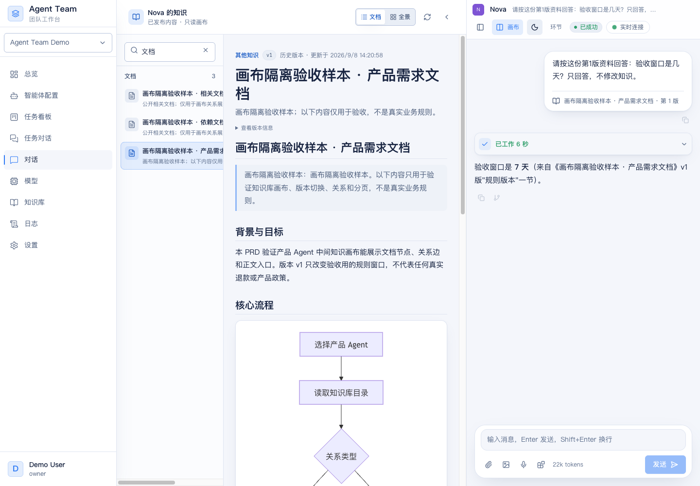
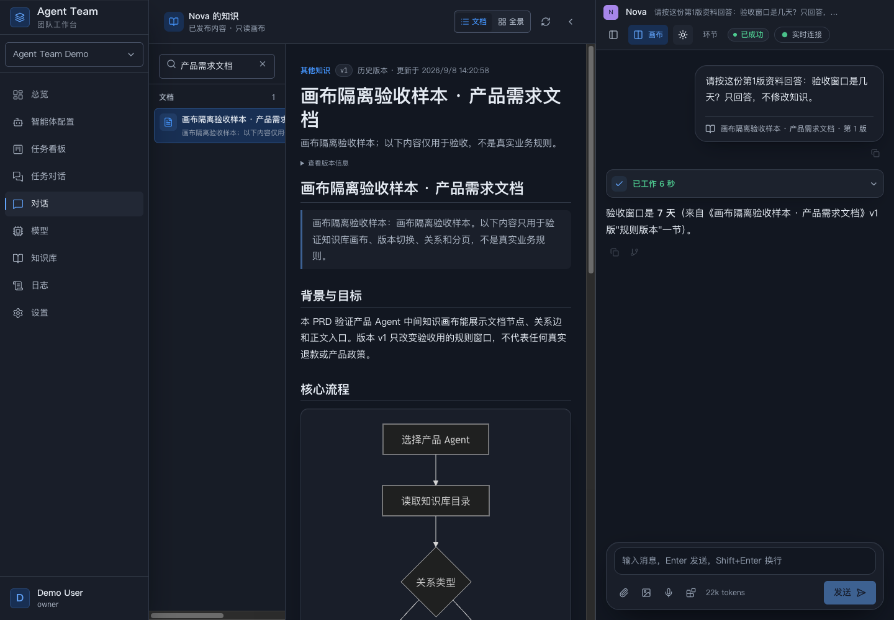
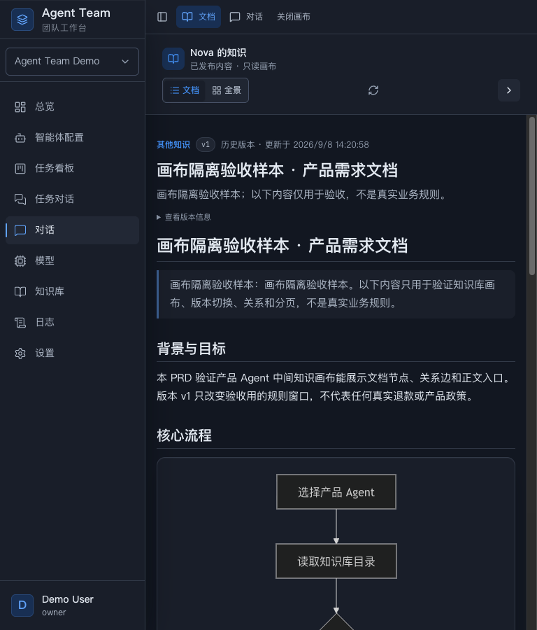

# 产品 Agent 知识画布验收

日期：2026-09-08。实现基线：`main@e34dcfc`；原工作树为 `agent-work-product-agent-canvas`，分支为 `codex/product-agent-canvas`。用户于同日明确授权合入 main，合并提交以 Git 历史为准；本次没有推送远端。

## 交付行为

- 产品 PM 默认打开中间知识画布与右侧真实 Chat；普通 Agent 可显式打开画布，设置按工作区和稳定 Agent ID 隔离。
- 文档与 React Flow 全景共用知识条目。列表按 owner 在服务端筛选，40 条一页；关系读取最多 60 个节点、并发不超过 4。
- 正文复用 AgentOutput，包含 Markdown、表格、Mermaid、目录、来源和版本。保存的文档不在第一页时，只额外读取该条，不扫描全库。
- 明暗外观沿用当前 LanguageGUI 中性表面、蓝色操作色与无衬线字体。没有移植早期草图的水墨配色。
- 选区带着确切版本、知识标识和章节进入右侧输入区；发送后的引用显示为可展开卡片。内部传输字段不占据用户聊天正文。
- 发送失败保留问题和可移除引用；同一 Agent 的对话切换、首轮创建与列表刷新保留正在阅读的历史正文。

## 自动检查

| 触面 | 结果 |
|---|---|
| Go 构建、静态检查 | `go build ./...`、`go vet ./...` 通过 |
| Go 包级 race | `go test -race -count=1 ./internal/persistence/sqlstore ./internal/httpapi` 通过；约 340s / 293s |
| 合并前 Go 复核 | 重新执行 build、vet 和 `TestKnowledge.*[Oo]wner` 触面 race，日志保留为 `merge-go-build.log`、`merge-go-vet.log`、`merge-go-race.log`；此前包级 race 的后台执行记录保留为 `backend-owner-verification.md` |
| 前端严格类型与生产构建 | `pnpm build` 内执行 `tsc -b`，通过 |
| 前端测试 | 116 个文件、939 条测试通过；最终 Mermaid 修复后相关 18 条测试与完整前端套件复核通过 |
| 前端 lint 与 token | `pnpm lint`、语义 token 门禁通过 |
| 加载边界 | React Flow 在单独的 `knowledge-graph` 动态 chunk，约 151 kB / gzip 49 kB；既有大 chunk 提示未被隐藏或放宽 |

## 真实 API 与界面检查

| 路径 | 实测结果 |
|---|---|
| 归属与权限视角 | Nova 可见 45 条自有知识；共享读取视角 44 条。其他 owner 同关键词样本被排除，私有样本没有进入共享集合 |
| 搜索和分页 | API 以 limit=7 逐页与 SQLite ID 集合对账，无重漏；UI 搜索样本按 40 + 4 继续加载 |
| 文档恢复 | 已打开的 PRD 不在初始 40 条内，重新打开后经单条读取恢复；新建对话时仍阅读同一份 v1 正文 |
| 版本变化 | v1 为 7 天，v2 为 14 天；通过仓储在副本追加 v3 的 21 天后，刷新显示新版提示但仍保留 v1，点击“查看新版本”才更新正文 |
| 来源与关联 | PRD 的 v2 有两条真实 `depends_on` / `related_to` 关联，UI 全景显示两条边；v3 样本没有携带这两条关系，发布后不再冒充当前关联 |
| 选区与错误恢复 | 点击“规则版本”段落并引用；人为阻断新建会话网络请求后，原问题与第 1 版引用卡均保留；恢复后使用既有发送/重试路径 |
| 真实 Agent 回复 | 最终 `kimi_local` Run `run_01M1ZYY0Y7J2J5R033G4EK0BDH` 成功，回复“验收窗口是 7 天（来自《画布隔离验收样本 · 产品需求文档》v1 版‘规则版本’一节）” |
| 首轮窄屏发送 | 1024px 下新建会话、发送引用后仍停留在对话视图，历史正文 v1 同时保留 |
| 图形交互 | 真实鼠标拖动改变节点位置；切换文档时图节点卸载，再回全景恢复相同位置。缩放与适应视图控件不再被缩略图遮挡；回归测试另覆盖关系刷新时保留位置、更新数据并移除不可见节点 |
| 明暗与窄窗口 | 1440px 中间画布 720px、右侧 Chat 480px；768px 下主导航全部可见，文档/对话明确切换，没有页面级横向溢出 |
| Portal | 设置 → 工作区“编辑”打开真实 Drawer；位于 React 根外、焦点在 dialog 内、暗色背景与全局主题一致，Escape 正常关闭 |
| Mermaid | 最终明暗两套 SVG 都含 6 个非空节点标签；修复了 SVG 清洗移除 HTML 标签造成空方框的问题，未放宽安全清洗 |

## 数据与环境边界

预览：[产品 Agent 画布](http://127.0.0.1:58475/chat?agent=agent_01M1TEPKAFN21SC95JKKYASSPK&c=wi_01M1ZYY0XAX45FBF7Y2ETZKHCW&canvas=knowledge)。预览使用副本与明确标注的验收样本；可搜索“产品需求文档”检查完整正文。

SQLite 由先前知识阅读验收库 backup 得到。本轮新增 45 个知识样本、46 个初始版本、2 条关系，随后追加 PRD v3。最终副本为 259 条知识、264 个版本、12 条关系和 90 个 Run，活动 Run 为 0。原知识库没有改动。

首轮运行遇到旧验收副本的 mount 广告缺失，之后又发现凭据文件未随 tracked 配置复制。仅在本预览进程载入已验证的原隔离 host registry，并复制现成凭据到本副本的 0600 文件；没有修改主配置、主数据库或其他 server。最后的隔离执行 Git checkout 仍干净。两次环境失败保留在验收历史中，没有伪装为成功。

合并收口时，原有 753 个验收文件已校验 SHA-256 后迁移到 **main 工作树**的 `agent-team-workbench/.agent-work/product-agent-canvas-acceptance-20260908/`，包括日志、数据库、seed helper、构建和 JSON 检查记录。该目录被 Git 忽略，凭据保留 0600 权限，没有进入提交。`merge-preservation.json` 记录迁移校验；`server.json` 记录当前预览进程；`start-preview.py` 用于重新启动。预览已从主树目录重启，保持原地址；浏览器验收 task space 已清理。

没有引入富文本编辑、白板绘画、多人协作或知识写入的新入口；这些仍属于后续独立需求。真实用户身份认证和远程执行宿主不是本次新增能力。

## 界面证据







## Mermaid 回归断言

打开带流程图的验收 PRD 后，在明暗两种模式分别等待 SVG 完成渲染，并执行以下浏览器断言。不能只检查方框或 SVG 是否存在：

```js
const labels = [...document.querySelectorAll('.chat-mermaid svg .node')]
  .map(node => node.textContent.trim());
if (labels.length === 0 || labels.some(label => !label)) {
  throw new Error('Mermaid 节点文字被清洗或未渲染');
}
```
