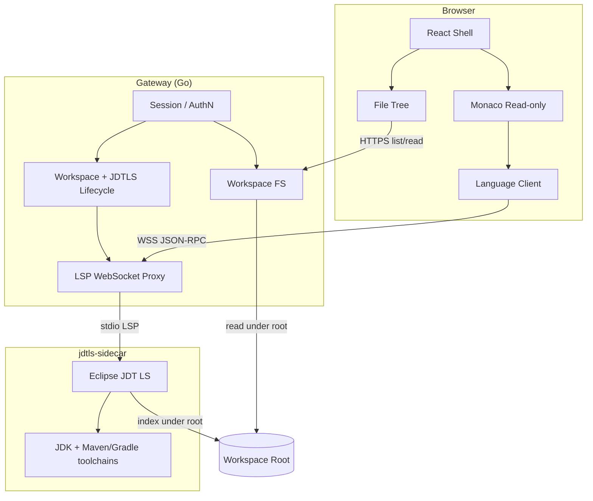

# 架构总览

Status: accepted

Date: 2026-08-30

权威级别：事实源（实现与本文冲突时，先改文档或提 ADR）

## 1. 设计原则

1. **能力子集，不是 IDE 克隆**：只交付浏览 + Java 语义导航。
2. **进程隔离**：UI、控制面、语言服务分进程；语言服务可杀可重启。
3. **单一信任边界**：Gateway 校验一切路径与会话；浏览器不可达 jdtls。
4. **按需启动**：无打开 Java 工程且需要语义时再拉起 jdtls；纯浏览不强制索引。
5. **契约先行**：FS API 与 LSP 代理信封进 `contracts/`，前后端按契约演进。
6. **可嵌入**：默认独立部署；接口不绑定某一宿主产品的领域模型。

## 2. 逻辑视图

## 3. 容器 / 进程

| 进程 | 技术选型 | 职责 |
|------|----------|------|
| `apps/web` | React + TypeScript + Monaco + monaco-languageclient | 目录树、编辑器、跳转 UX |
| `apps/gateway` | Go | 鉴权、FS、工作区会话、LSP 代理、sidecar 生命周期 |
| `apps/jdtls-sidecar` | JRE 21+ + eclipse.jdt.ls | Java 语义；无业务 HTTP |

选型理由见 [ADR-002](../decisions/ADR-002-monaco-jdtls-not-theia.md)、[ADR-003](../decisions/ADR-003-three-process-architecture.md)。

## 4. 关键数据流

### 4.1 打开文件

1. UI 请求 `GET /api/v1/workspaces/{id}/fs/tree?path=` / `.../fs/file?path=`
2. Gateway 规范化路径，断言位于 Workspace Root 内，读盘返回
3. Monaco 以只读 model 展示；扩展名映射语法高亮

### 4.2 Go to Definition

1. Language Client 经 WSS 发送 LSP `textDocument/definition`
2. Gateway 将帧转发到该工作区绑定的 jdtls stdio
3. jdtls 返回 `Location[]`；Client 请求打开目标 path（再走 FS API）
4. 若为 `jdt://`（依赖 jar），MVP 可提示「依赖类暂不支持」或按路线图 P3 拉取反编译内容

## 5. 质量属性

| 属性 | 目标 | 手段 |
|------|------|------|
| 安全 | 无法读出 Workspace Root 外文件 | 路径规范化 + root jail；见 security.md |
| 可恢复 | jdtls OOM/崩溃不拖垮 Gateway | sidecar 分进程；重启与退避 |
| 性能（浏览） | 目录展开 &lt; 200ms 量级（本地盘） | 无索引依赖；分页/忽略大目录 |
| 性能（语义） | 首次索引可分钟级；之后跳转秒内 | 进度事件；UI 明示「索引中」 |
| 可嵌入 | 无硬编码宿主 URL | CORS / 反向代理友好；token 注入 |

## 6. 文档地图

| 主题 | 文档 |
|------|------|
| 外部边界 | [system-context.md](system-context.md) |
| 组件与 API | [components.md](components.md) |
| LSP | [lsp-bridge.md](lsp-bridge.md) |
| FS | [workspace-fs.md](workspace-fs.md) |
| 安全 | [security.md](security.md) |
| 部署 | [deployment.md](deployment.md) |
| 切片 | [roadmap.md](roadmap.md) |
