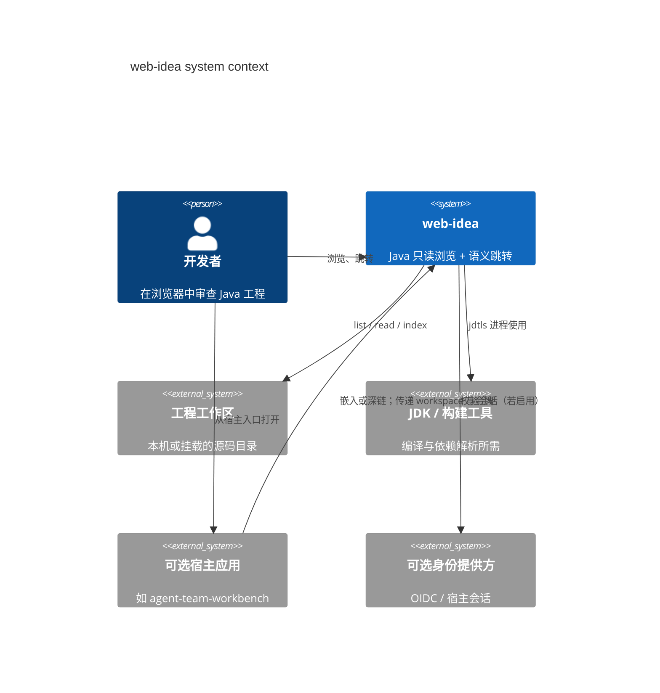

# 系统上下文

Status: accepted

Date: 2026-08-30

## 上下文图



## 参与者

| 参与者 | 期望 |
|--------|------|
| 开发者 | 打开工程、读代码、跳定义/引用 |
| 宿主应用（可选） | 传入 `workspaceRoot`（或托管路径 id）与短期凭证；展示嵌入 UI |
| 运维 | 部署 Gateway + sidecar；限制 CPU/内存；挂载只读或读写卷 |

## 信任边界

```text
                    ┌─────────────────────────────────────┐
  Browser           │  Untrusted                          │
                    └─────────────────┬───────────────────┘
                                      │ TLS + session
                    ┌─────────────────▼───────────────────┐
  Gateway           │  Trusted computing base (TCB)       │
                    │  path jail · auth · process spawn   │
                    └─────────────────┬───────────────────┘
                                      │ local stdio / unix
                    ┌─────────────────▼───────────────────┐
  jdtls + disk      │  Same machine trust; still jailed   │
                    │  by gateway-chosen root & uid       │
                    └─────────────────────────────────────┘
```

浏览器与公网 **不** 直接接触磁盘或 jdtls。

## 外部依赖

| 依赖 | 用途 | 失败影响 |
|------|------|----------|
| JDK 21+ | 运行 jdtls | 语义不可用；浏览仍可用 |
| Maven / Gradle（工程侧） | 依赖解析 | 索引不完整；跳转降级 |
| eclipse.jdt.ls 发行物 | 语言服务 | 同上 |
| （可选）宿主 IdP | 登录 | 独立模式可用本地/开发令牌 |

## 非连接

本系统 **不** 直接：

- 调用 LLM / Agent Run API（那是宿主职责）；
- 写回 git（MVP 只读；写盘需新 ADR）；
- 依赖 JetBrains 专有协议或 Projector。
